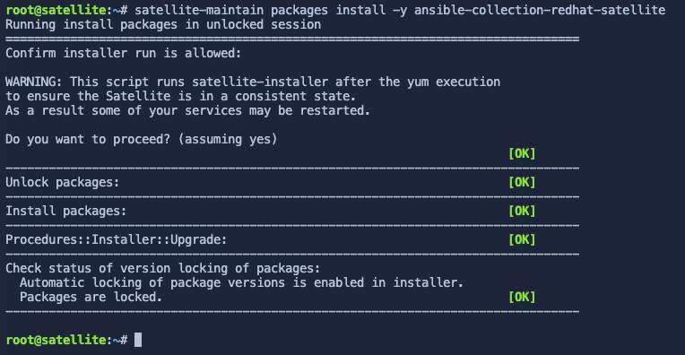

In this assignment, we'll create an ansible playbook to automatically configure the Satellite server. Red Hat provides an Ansible collection to manage Red Hat Satellite configuration. Ansible playbooks are useful for building disaster recovery instances of Satellite, or any other task that requires a second Satellite server, including testing, and upgrades.

Documentation for the Satellite Ansible collection can be found [here](https://console.redhat.com/ansible/automation-hub/repo/published/redhat/satellite/docs) (Red Hat account required).

Install the Satellite Ansible collection
===

> [!NOTE]
> To reduce the amount of time waiting for for satellite operations to complete, the Satellite Ansible Collection has been preinstalled. Please read over this section and go to the next step.

> [!WARNING]
> Proceed to the next step.

> [!NOTE]
> For reference, the following command installs the Satellite Ansible Collection.
>
> ```nocopy
> satellite-maintain packages install -y ansible-collection-redhat-satellite
> ```



Create a playbook to configure the Satellite server
===

The playbook below is simply an example.

> [!WARNING]
> Never put clear text passwords in your playbook.

Click this button [button label="Satellite Server" background="#ee0000" color="#c7c7c7"](tab-0) to switch to the `Satellite Server` terminal.


Next, click `run` below to write the following ansible playbook.

```bash,run
tee ~/config.yml << EOF
---
- name: Configure Satellite 6.17
  hosts: localhost
  remote_user: root

  tasks:
  - name: "Create an activation key."
    redhat.satellite.activation_key:
      username: "admin"
      password: "bc31c9a6-9ff0-11ec-9587-00155d1b0702"
      server_url: "https://satellite.lab"
      name: "RHEL9"
      content_view: "Default Organization View"
      organization: "Acme Org"
      lifecycle_environment: "Library"
      content_overrides:
          - label: satellite-client-6-for-rhel-9-x86_64-rpms
            override: enabled
          - label: Acme_Org_Satellite_Extras_Satellite
            override: enabled
EOF
```

This playbook creates an `activation key` which is used to control access to repositories on Satellite. In this particular `activation key`, the Satellite 6 client repository is overridden to enabled.

The RHEL 9 BaseOS and AppStream, and Satellite Client repos have already been synchronized and enabled to save time. These repos are available through the default `Library` lifecycle environment.

Execute the playbook
===

Execute the playbook by clicking on `run`.

```bash,run
ansible-playbook config.yml
```

> [!NOTE]
> The repositories configured have already been synchronized to save time.

Click next to advance to the next assignment.
