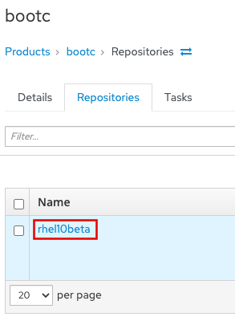
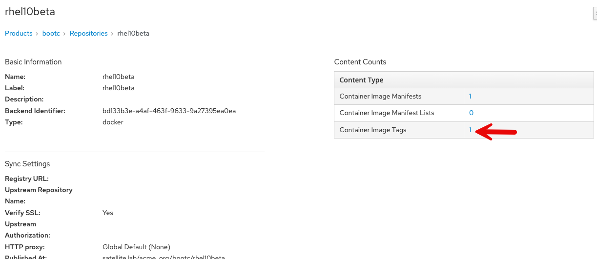
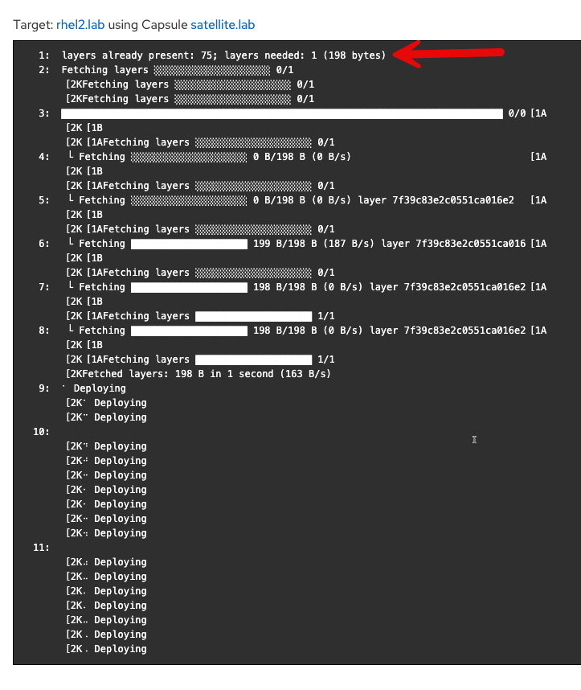

Image mode is a new approach to operating system (OS) deployment that lets users build, deploy, and manage Red Hat Enterprise Linux as a bootc container image.

It reduces complexity across the enterprise by letting development, operations, and solution providers use the same container-native tools and techniques to manage everything from applications to the underlying OS.

Red Hat Satellite 6.17 supports the management of RHEL image mode systems. In this assignment, we'll walk through the steps of registering and updating an image mode system.

Create a container repository in Satellite
===
Go to the Satellite Web UI.

Do the following:
1) Click on `Products`.
2) Click `Create Product`.


Then we'll create a product called `bootc`.
1) Name the product `bootc`.
2) Click on `Save`.


Create an activation key for our image mode host
===
In this lab environment, we have a ready-built image mode host named `rhel2`. We will generate an activation key and register `rhel2` to the Satellite server.

Go to the Activation Keys menu.


Click "Create Activation Key".


Do the following to create our activation key.
1) Name the key `bootc-summit`.
2) Click on "Library".
3) Select the "Default Organization View" Content View.
4) Click "Save".


Register the image mode host rhel2 to Satellite
===

Switch to the Satellite terminal.


From the `Satellite Server` terminal, run the following script.
```bash,run
export regscript=$(hammer host-registration generate-command --activation-key bootc-summit --setup-insights false --insecure true --force 1)
ssh -o "StrictHostKeyChecking no" rhel2 $regscript
```

Here's what the successful registration looks like.


Verify image mode host details in Satellite
===
Let's explore the image mode information available in Satellite.

Navigate back to the Satellite Web UI.

1) Click on the "Booted Container images" menu.
2) You will be able to see that one image mode host is detected. Click on this link.

Here's what the "Hosts" menu shows.

Next do the following.
1) Check the box to the left of the Power button.
2) Select "Schedule Remote Job".


Next we'll create a job to check bootc status.
1) Select the "Bootc" category.
2) Select "Bootc Status - Script Default".
3) Click "Run on selected hosts".


Click on the "rhel2.lab" link.


Here you can see lots of information about the current status of the bootc system rhel2, including the image it was booted from.


Click on "rhel2.lab" to get to the host menu.


Click on the details tab.


Scroll down to the "Image mode details" card.


Here you can also see the "Running image" details which we will need to use in the next step. This information is populated only after the bootc status job is run or approximately every 4 hours.

Update the container image
===
The container image running on `rhel2` is stored in a quay.io registry. We want to modify that image. We'll use the host `rhel1` to pull down that container image from quay.io and update it.

Navigate to the `rhel1` terminal.

```bash,run
cat <<EOT > Containerfile
FROM quay.io/toharris/rhel-bootc:summit-2025
RUN echo “Welcome to Summit 2025” > /etc/motd
EOT
```

```bash,run
podman build -f Containerfile -t satellite.lab/acme_org/bootc/rhel10beta:summit-2025
```

Push the new container to Satellite's container registry
===
Now we'll push the updated container image from `rhel1` to the Satellite container registry.

Log into Satellite container registry.
```bash,run
podman login --tls-verify=false satellite.lab
```

Use the following credentials.

Admin
```bash
admin
```

Password
```bash
bc31c9a6-9ff0-11ec-9587-00155d1b0702
```

Now we'll push our updated container image to Satellite.
```bash,run
podman push satellite.lab/acme_org/bootc/rhel10beta:summit-2025 --tls-verify=false
```

Enable unauthenticated pull operations for container images on Satellite
===

Next we want to enable unauthenticated pull for container images.


Go to Products







```
satellite.lab/acme_org/bootc/rhel10beta:summit-2025
```





