<some preamble about image mode and what it is and why satellite supports it>


Create a container repository in Satellite
===
Go to the Satellite Web UI.

Do the following:
1) Click on `Products`.
2) Click `Create Product`.


Then we'll create a product called `bootc`.
1) Name the product `bootc`.
2) Click on `Save`.


Create an activation key for our image mode host
===
In this lab environment, we have a ready-built host called `rhel2`.

<fill in later>

Go to the Activation Keys menu.

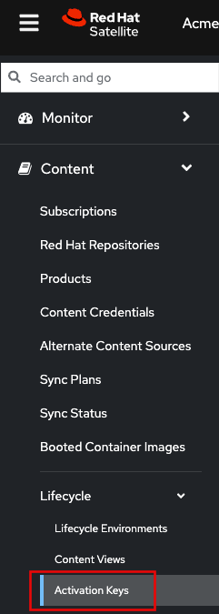

Click "Create Activation Key".


Do the following to create our activation key.
1) Name the key `bootc-summit`.
2) Click on "Library".
3) Select the "Default Organization View" Content View.
4) Click "Save".


Register the image mode host rhel2 to Satellite
===

Switch to the Satellite terminal.

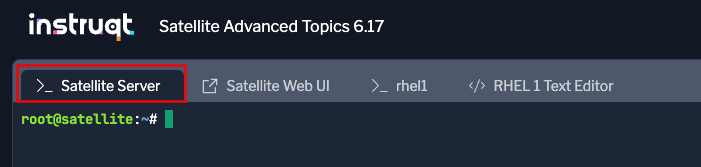

Run the following script.
```bash,run
export regscript=$(hammer host-registration generate-command --activation-key bootc-summit --setup-insights false --insecure true --force 1)
ssh -o "StrictHostKeyChecking no" rhel2 $regscript
```

Here's what the successful registration looks like.

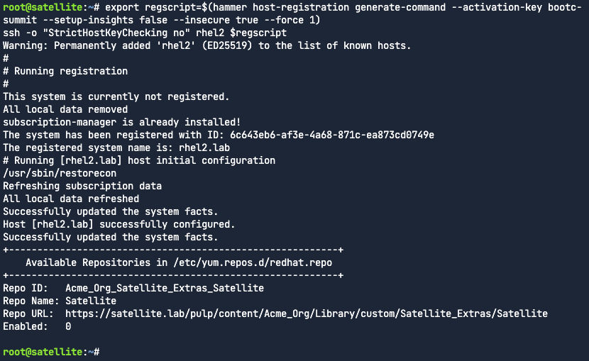

Verify image mode host details in Satellite
===

Navigate back to the Satellite Web UI.

1) Click on the "Booted Container images" menu.
2) You will be able to see that one image mode host is detected. Click on this link.

Here's what the "Hosts" menu shows.

Next do the following.
1) Check the box to the left of the Power button.
2) Select "Schedule Remote Job".


Next we'll create a job to check bootc status.
1) Select the "Bootc" category.
2) Select "Bootc Status - Script Default".
3) Click "Run on selected hosts".


Click on the "rhel2.lab" link.

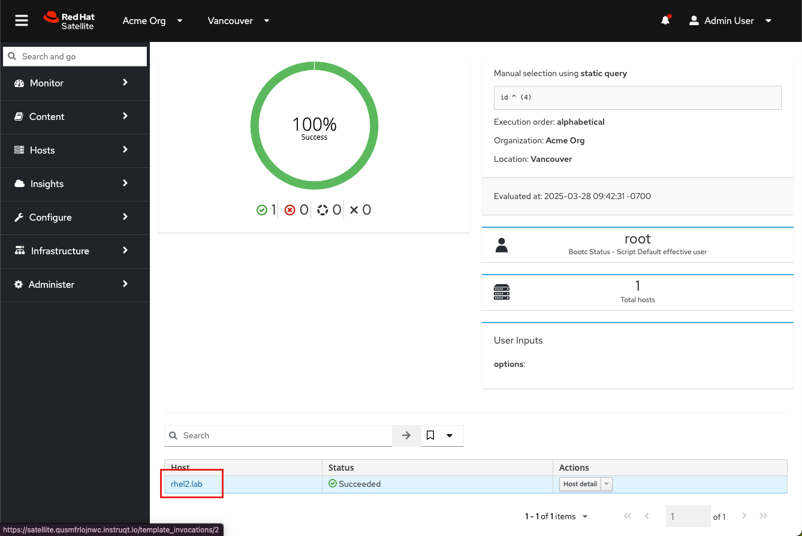

Here you can see lots of information about the current status of the bootc system rhel2, including the image it was booted from.


Click on "rhel2.lab" to get to the host menu.

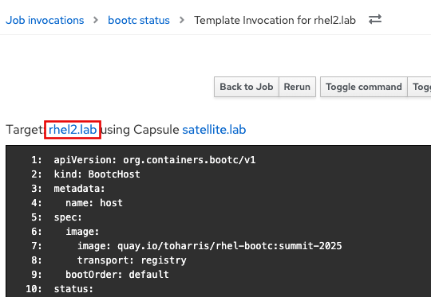

Click on the details tab.


Scroll down to the "Image mode details" card.


Here you can also see the "Running image" details which we will need to use in the next step. This information is populated only after the bootc status job is run or approximately every 4 hours.

Update image mode hosts
===

Navigate to the rhel1 terminal.

```bash,run
cat <<EOT > Containerfile
FROM quay.io/toharris/rhel-bootc:summit-2025
RUN echo “Welcome to Summit 2025” > /etc/motd
EOT
```

```bash,run
podman build -f Containerfile -t satellite.lab/acme_org/bootc/rhel10beta:summit-2025
```

Next, log into Satellite container registry.
```bash,run
podman login --tls-verify=false satellite.lab
```

Use the following credentials.

Admin
```bash,run
admin
```

Password
```bash,run
bc31c9a6-9ff0-11ec-9587-00155d1b0702
```

Push our modified image to Satellite.
```bash,run
podman push satellite.lab/acme_org/bootc/rhel10beta:summit-2025 --tls-verify=false
```

Next we want to enable unauthenticated pull for container images.

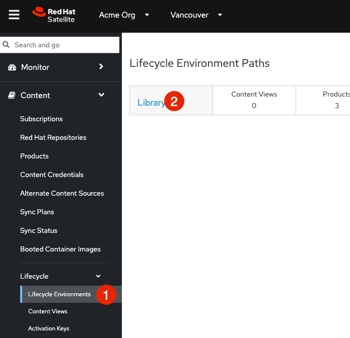

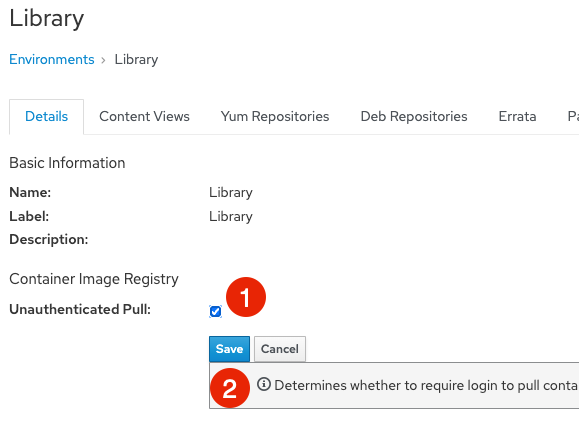

Go to Products

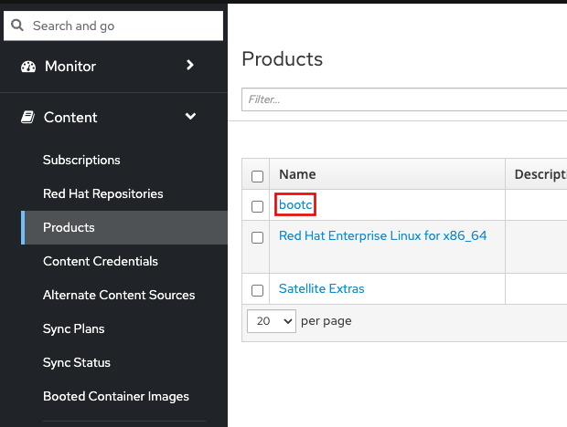


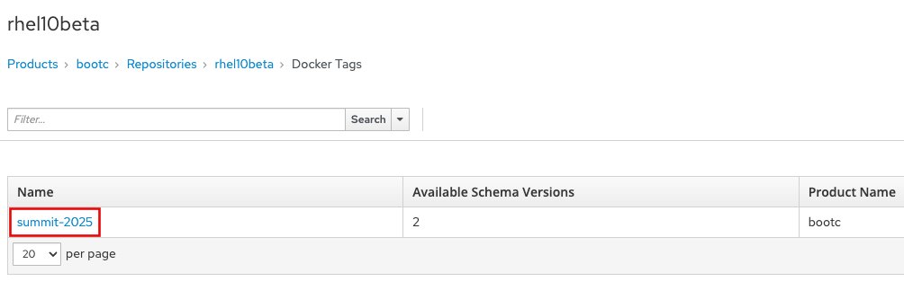

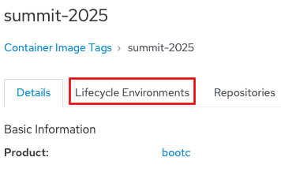


```
satellite.lab/acme_org/bootc/rhel10beta:summit-2025
```


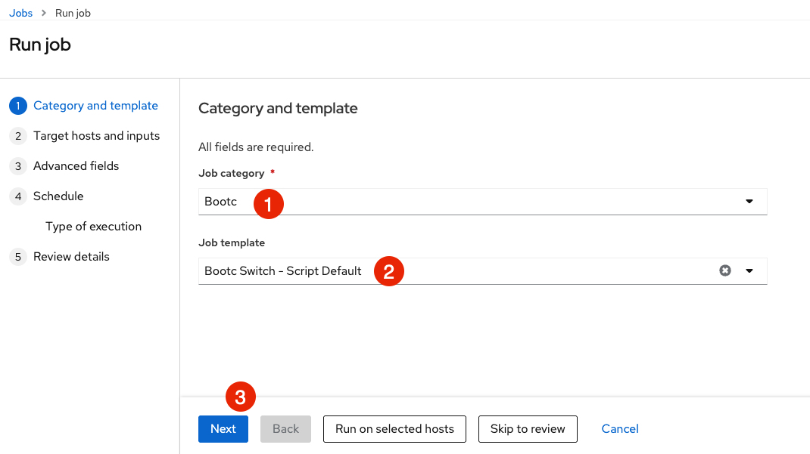


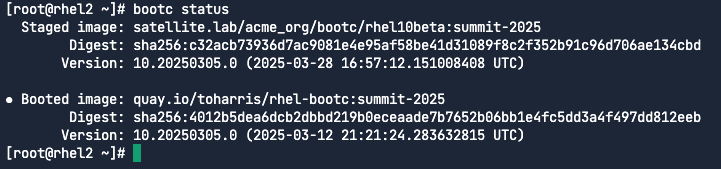


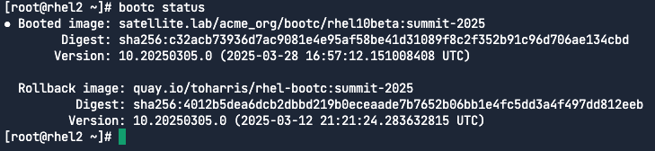

