In this assignment, we'll configure the host `capsule.lab` as a Capsule server.

Red Hat Satellite Capsule Servers mirror content from Red Hat Satellite Server to facilitate content federation across various geographical locations. Host systems can pull content from the Capsule Server and not from the central Satellite Server. The Capsule Server also provides localized services such as Puppet Master, DHCP, DNS, or TFTP. Capsule Servers assist you in scaling your Satellite environment as the number of your managed systems increases.

Capsule Servers decrease the load on the central server, increase redundancy, and reduce bandwidth usage.

Synchronize the repositories containing capsule server software to the Satellite server
===

We need to provide the following repositories to the capsule server.

- `rhel-9-for-x86_64-baseos-rpms`

- `rhel-9-for-x86_64-appstream-rpms`

- `satellite-capsule-6.16-for-rhel-9-x86_64-rpms`

- `satellite-maintenance-6.16-for-rhel-9-x86_64-rpms`

Copy and paste the following playbook to the satellite server in the [button label="Satellite Server"](tab-0) terminal.

```bash,run
tee ~/capsulerepos.yml << EOF
---
- name: Add and sync capsule server repositories.
  hosts: localhost
  remote_user: root

  tasks:
  - name: "Enable RHEL 9 BaseOS RPMs repository with label"
    redhat.satellite.repository_set:
      username: "admin"
      password: "bc31c9a6-9ff0-11ec-9587-00155d1b0702"
      server_url: "https://satellite.lab"
      organization: "Acme Org"
      label: rhel-9-for-x86_64-baseos-rpms
      repositories:
        - releasever: "9"

  - name: "Enable RHEL 9 AppStream RPMs repository with label"
    redhat.satellite.repository_set:
      username: "admin"
      password: "bc31c9a6-9ff0-11ec-9587-00155d1b0702"
      server_url: "https://satellite.lab"
      organization: "Acme Org"
      label: rhel-9-for-x86_64-appstream-rpms
      repositories:
        - releasever: "9"

  - name: "Satellite 6 client repository with label without specifying base arch"
    redhat.satellite.repository_set:
      username: "admin"
      password: "bc31c9a6-9ff0-11ec-9587-00155d1b0702"
      server_url: "https://satellite.lab"
      organization: "Acme Org"
      label: satellite-client-6-for-rhel-9-x86_64-rpms
      all_repositories: true
      state: enabled

  - name: "Satellite capsule software for 6.16"
    redhat.satellite.repository_set:
      username: "admin"
      password: "bc31c9a6-9ff0-11ec-9587-00155d1b0702"
      server_url: "https://satellite.lab"
      organization: "Acme Org"
      label: satellite-capsule-6.16-for-rhel-9-x86_64-rpms
      all_repositories: true
      state: enabled

  - name: "Satellite maintenance software for 6.16"
    redhat.satellite.repository_set:
      username: "admin"
      password: "bc31c9a6-9ff0-11ec-9587-00155d1b0702"
      server_url: "https://satellite.lab"
      organization: "Acme Org"
      label: satellite-maintenance-6.16-for-rhel-9-x86_64-rpms
      all_repositories: true
      state: enabled

  - name: "Create activation key for capsule."
    redhat.satellite.activation_key:
      username: "admin"
      password: "bc31c9a6-9ff0-11ec-9587-00155d1b0702"
      server_url: "https://satellite.lab"
      name: "RHEL9"
      organization: "Acme Org"
      lifecycle_environment: "Library"
      content_overrides:
          - label: satellite-client-6-for-rhel-9-x86_64-rpms
            override: enabled
          - label: satellite-maintenance-6.16-for-rhel-9-x86_64-rpms
            override: enabled
          - label: satellite-capsule-6.16-for-rhel-9-x86_64-rpms
            override: enabled
EOF
```

> [!NOTE]
> The `Modify activation key` task of the playbook overrides the aforementioned repositories to `enabled`, providing `capsule` access to the repos.

Run the playbook.

```bash,run
ansible-playbook capsulerepos.yml
```

> [!NOTE]
> In the playbook we just ran, we did not synchronize the repositories since they were pre-synchronized. This measure was taken to save time.

The RHEL 9 repositories were synchronized in the background of this lab. The synchronization step should only take a few seconds.

Register the Capsule host with Satellite
===

Register the host `capsule` with satellite.

You can generate a host registration script on the [button label="Satellite Server"](tab-0) terminal with the following command.

> [!NOTE]
> This registration script is specific to the capsule and provides access to RHEL 9 repos.

```bash,run
hammer host-registration generate-command --insecure 1 --setup-insights 0 --force 1 --activation-key RHEL9
```

> [!IMPORTANT]
> Copy the output of this command from the [button label="Satellite Server"](tab-0) terminal, paste it into the [button label="Capsule"](tab-2) terminal, and run it.

Configure the repositories on the Capsule host
===

To install the capsule software, we have to configure the correct repositories. Run the following command in the [button label="Capsule"](tab-2) terminal to disable repos.

```bash,run
subscription-manager repos --disable "*"
```

Now enable the repositories the required repositories.

```bash,run
subscription-manager repos --enable=rhel-9-for-x86_64-baseos-rpms \
--enable=rhel-9-for-x86_64-appstream-rpms \
--enable=satellite-capsule-6.16-for-rhel-9-x86_64-rpms \
--enable=satellite-maintenance-6.16-for-rhel-9-x86_64-rpms
```

Install the capsule software
===

On the [button label="Capsule"](tab-2) server run the following command to install the capsule software.

```bash,run
dnf install satellite-capsule -y
```

> [!NOTE]
> While the capsule software is installing, you can proceed to the next step.

Export the Default SSL Certificate from the Satellite server
===

On the [button label="Satellite Server"](tab-0), in the `Satellite Server` terminal, create a directory to store the SSL certificate.

```bash,run
mkdir /root/capsule_cert
```

Generate the capsule certificate by entering the following in the [button label="Satellite Server"](tab-0) terminal.

```bash,run
capsule-certs-generate \
--foreman-proxy-fqdn capsule.lab \
--certs-tar /root/capsule_cert/capsule.lab-certs.tar
```

> [!NOTE]
> In the above command, the FQDN for the capsule server, `capsule.lab` must be specified for the `--foreman-proxy-fqdn` flag.

Here's what the output should look like.

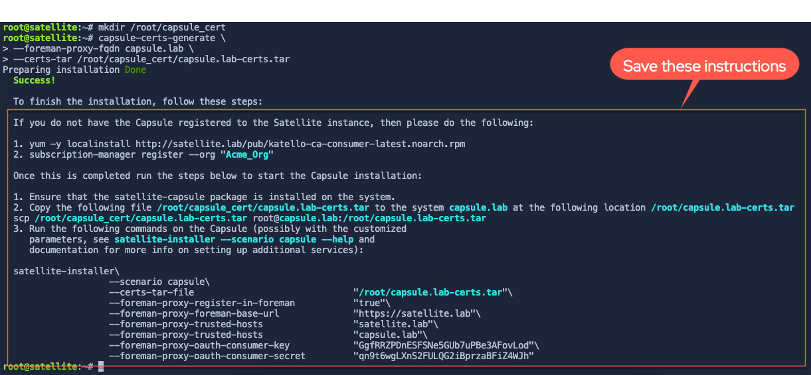

> [!IMPORTANT]
> Record the instructions in the output of the command. You'll need these!
> A Notepad has been provided in the [button label="Notepad"](tab-4) tab. You can copy and paste the registration command to it.
>  > 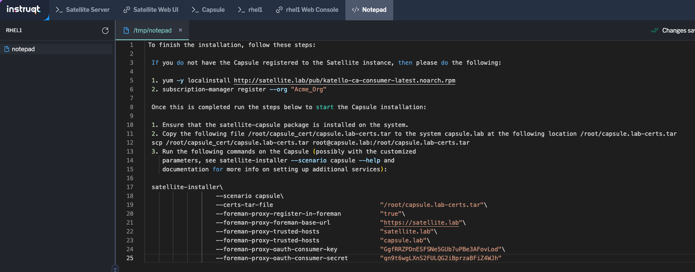

Copy the certificate from `satellite.lab` to `capsule.lab`
===

Copy the certificate from[button label="Satellite Server"](tab-0) to `capsule.lab`. In the [button label="Satellite Server"](tab-0) run the following command.

```bash,run
scp -o StrictHostKeyChecking=no /root/capsule_cert/capsule.lab-certs.tar capsule.lab:/root/capsule.lab-certs.tar
```


Run the capsule configuration task
===

Before proceeding, check that the capsule software installation is complete.

As per the instructions from the output of the `capsule-cert-generate`, copy, paste and run the `satellite-installer` command in the [button label="Capsule"](tab-2) terminal.

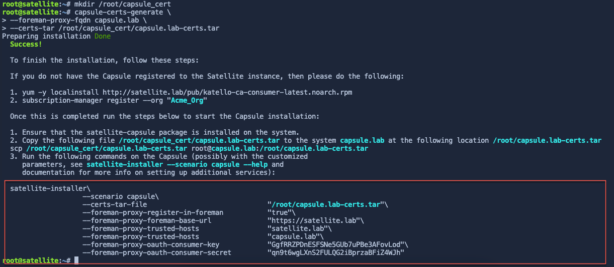

Here's what the output should look like.


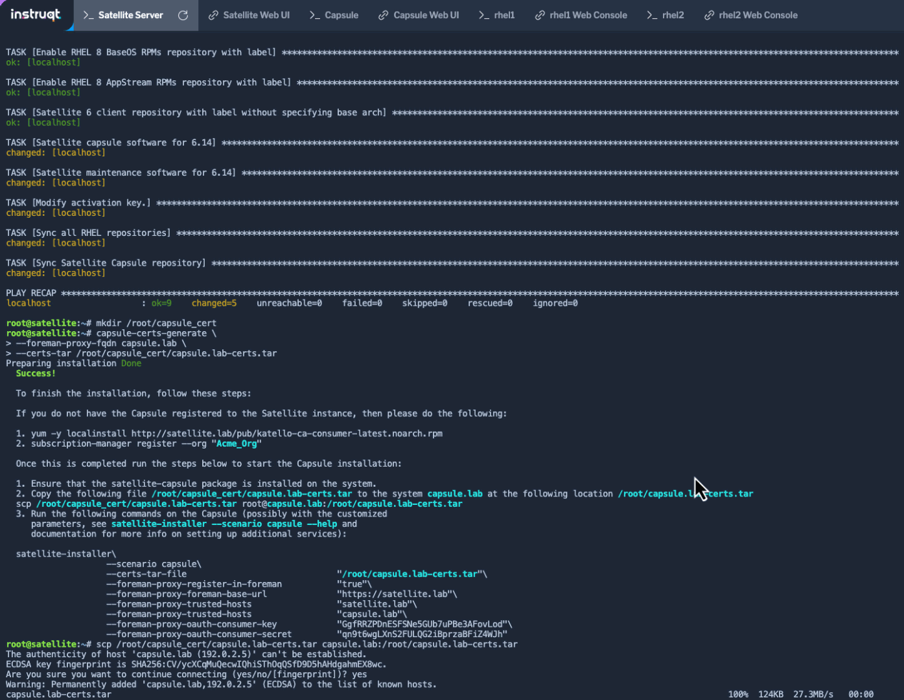

> [!WARNING]
> Capsule configuration takes about 5 minutes to complete.

Configure lifecycle environment and content views
===

At present, the capsule server `capsule.lab` cannot provide any software. To do so, we must synchronize metadata to `capsule.lab`, that is, information about the software and repositories available to `satellite.lab`. It is possible to synchronize all metadata and software packages to `capsule.lab` but it can take a lot of time and consume a lot of storage. We control the synchronization of software repositories to capsule servers through lifecycle environments.

The `satellite.lab` server only has a single lifecycle environment (LCE) named `Library`. `Library` is a default LCE and contains all repositories. To synchronize all metadata (we have not specified that all software must be synchronized), we could tell satellite to synchronize the entire `Library` LCE to the capsule.

In a real-life environment, it is not always practical or desireable to synchronize all software to capsule servers since it could take a long time and consume a vast amount of storage.

Content views are used to specify repositories and provide granular control of specific RPM package versions that can be added to a lifecycle environment. We'll use a combination of a content view and an LCE to synchronize RHEL 9 BaseOS, AppStream, and Satellite Client software to the capsule server `capsule.lab`.

To read more about lifecycle environments, please refer to the official documentation [here](https://access.redhat.com/documentation/en-us/red_hat_satellite/6.16/html/managing_content/managing_application_lifecycles_content-management).

To read more about content views, please refer to the official documentation [here](https://access.redhat.com/documentation/en-us/red_hat_satellite/6.16/html/managing_content/managing_content_views_content-management).

Copy and paste the following playbook into the [button label="Satellite Server"](tab-0) terminal.

```bash,run
tee ~/capsulesync.yml << EOF
---
- name: Configure a lifecycle environment and a content view.
  hosts: localhost
  remote_user: root

  tasks:
  - name: "Create the Capsule Production lifecycle environment"
    redhat.satellite.lifecycle_environment:
      username: "admin"
      password: "bc31c9a6-9ff0-11ec-9587-00155d1b0702"
      server_url: "https://satellite.lab"
      organization: "Acme Org"
      name: "Capsule Production"
      label: "capsule_production"
      prior: "Library"
      state: "present"

  - name: "Create RHEL9 content view"
    redhat.satellite.content_view:
      username: "admin"
      password: "bc31c9a6-9ff0-11ec-9587-00155d1b0702"
      server_url: "https://satellite.lab"
      organization: "Acme Org"
      name: "RHEL9"
      repositories:
        - name: 'Red Hat Enterprise Linux 9 for x86_64 - BaseOS RPMs 9'
          product: 'Red Hat Enterprise Linux for x86_64'

  - name: "Publish a content view and promote that version to Capsule Production LCE, not idempotent"
    redhat.satellite.content_view_version:
      password: "bc31c9a6-9ff0-11ec-9587-00155d1b0702"
      server_url: "https://satellite.lab"
      organization: "Acme Org"
      username: "admin"
      content_view: "RHEL9"
      lifecycle_environments:
        - "Capsule Production"
EOF
```

Run the playbook.

```bash,run
ansible-playbook capsulesync.yml
```

This playbook creates the LCE named "Capsule Production" and the content view "RHEL9" which contains the RHEL9 BaseOS repository.

> [!NOTE]
> For the purposes of this lab, all of this content has been seeded to the satellite server so the synchronization should take only a few minutes.

Configure satellite.lab to replicate the Capsule Production lifecycle environment to capsule.lab
===

In the `Satellite Web UI`, navigate to the capsule menu.

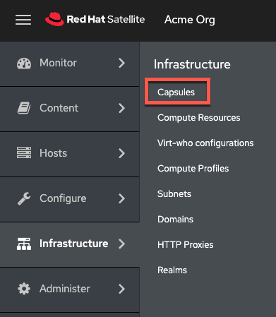

You should see the capsule server.

Click on `capsule.lab`


Click on `Edit`.

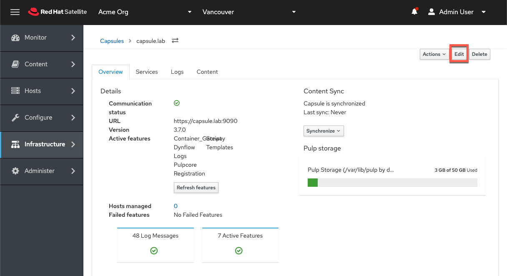

Click on `Lifecycle Environments`.

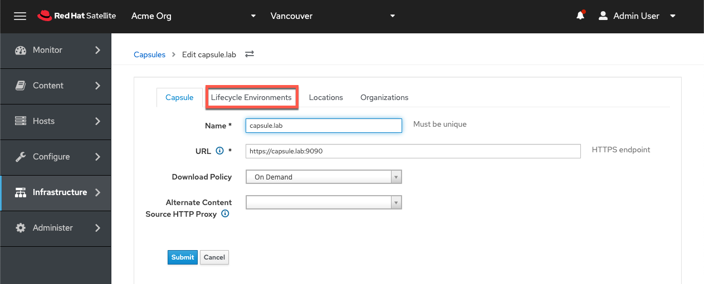

Configure `satellite.lab` to synchronize the `Capsule Production` lifecycle environment to `capsule.lab`.

1. Click on `Capsule Production`.

2. Click `Submit`.

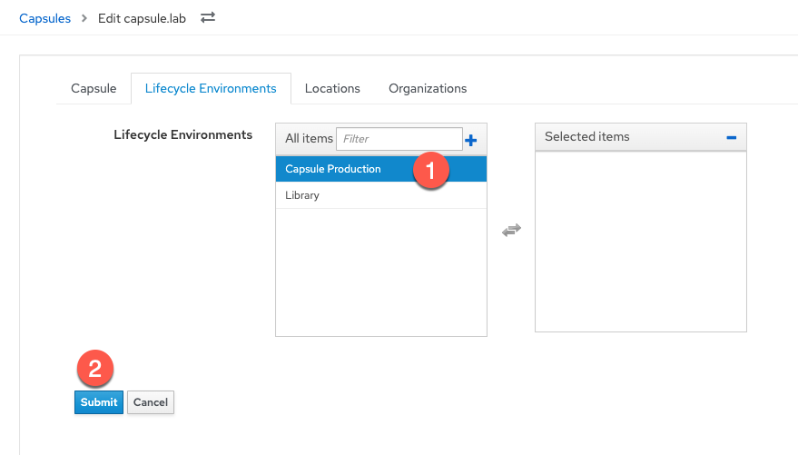

Click on the `capsule.lab` button again.


Click on `Optimized Sync` to synchronize repo metadata to the capsule.

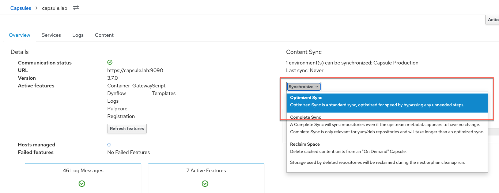

> [!NOTE]
>
> 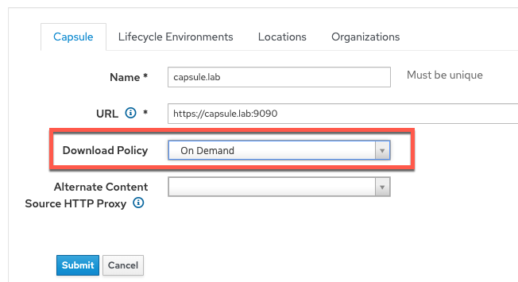
>
> We left the `Download Policy` on the default setting of `On Demand`. This means that metadata will be synchronized to the capsule server but the software will only be synchronized on-demand, when a host makes the request to the capsule server to install software.

Migrate rhel1 to the capsule server.
===

In the [button label="rhel1"](tab-3) terminal enter the following command to view the redhat.repo file.

```bash,run
cat /etc/yum.repos.d/redhat.repo
```

The output will look like this.

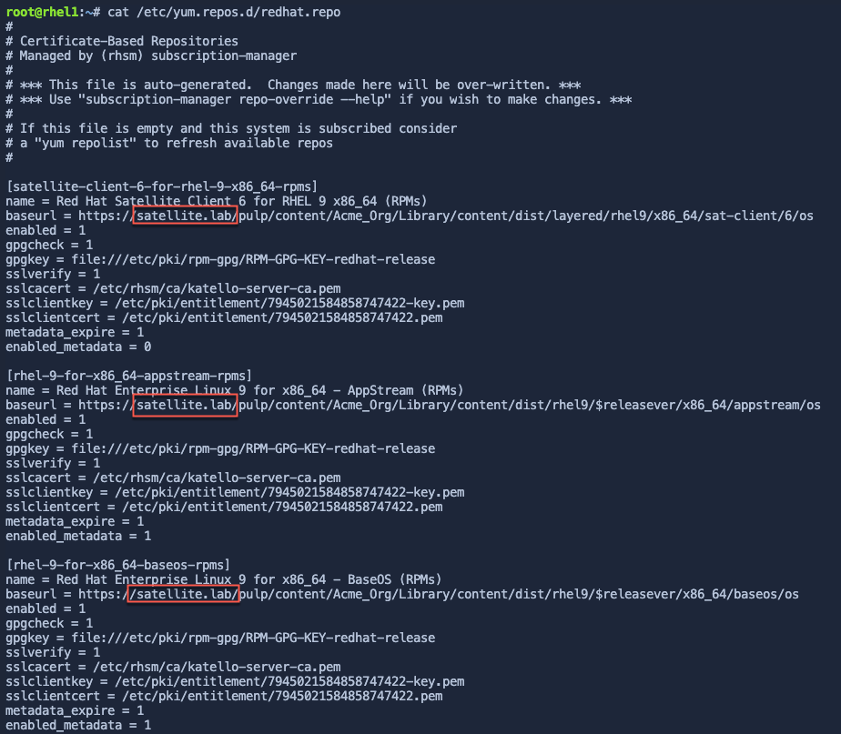

`rhel1` is using the BaseOS, AppStream and Satellite Client repositories provided by the `satellite.lab` server.

When we migrate `rhel1` to `capsule.lab`, `rhel1` will only have access to the BaseOS repository as configured in the `RHEL9` content view.

Navigate to the `All Hosts` menu.

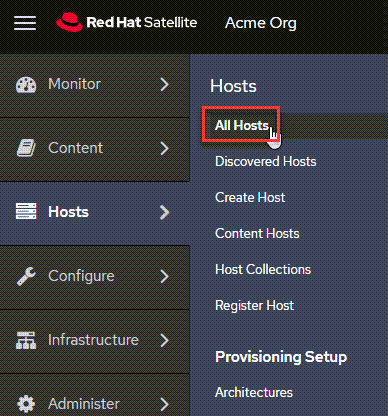

Do the following.

1. Select `rhel1`.

2. Click `Change Content Source`.

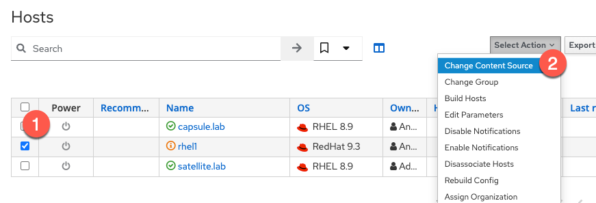

Perform the following actions.

1. Select `capsule.lab` in the `Content source` dropdown.

2. In the `Lifecycle environment` section, choose `Capsule Production`.

3. Choose the content view `RHEL9`.

4. Click `Run job invocation`.

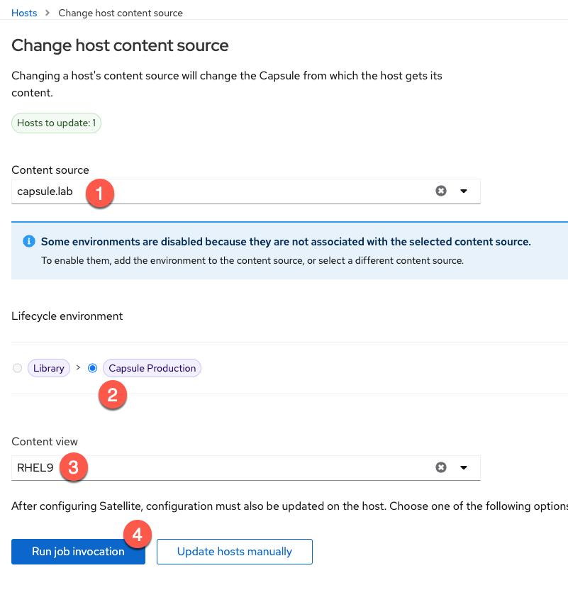

In the `Run job` menu, click on `Run on selected hosts`.

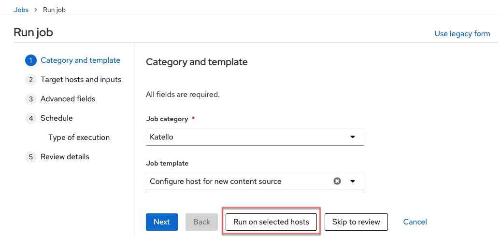

You can verify that `rhel1` was successfully migrated to `capsule.lab` by viewing the `/etc/yum.repo.d/redhat.repo` file.

In the [button label="rhel1"](tab-3) terminal, run this.

```bash,run
cat /etc/yum.repos.d/redhat.repo
```

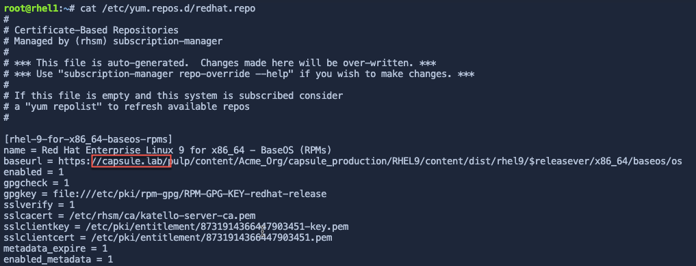

The `redhat.repo` will show that the baseurl points at `capsule.lab`. As well, `rhel1` only has access to the `BaseOS` repository as defined in the `RHEL9` content view.

Please note that you would normally also provide access to the `AppStream` repository as well. `AppStream` was ignored in order to save time.
