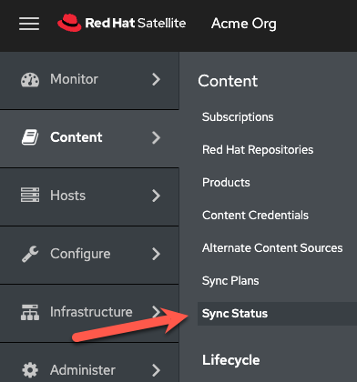

The first activity in this lab is to create an ansible playbook to automatically configure the Satellite server. Red Hat provides an Ansible collection to manage Red Hat Satellite configuration. Ansible playbooks are useful for building disaster recovery instances of Satellite, or any other task that requires a second Satellite server, including testing, and upgrades.

Documentation for the Satellite Ansible collection can be found [here](https://console.redhat.com/ansible/automation-hub/repo/published/redhat/satellite/docs) (Red Hat account required).

Install the Satellite Ansible collection
========================================
__To reduce the amount of time waiting for for satellite operations to complete, the Satellite Ansible Collection has been preinstalled. Proceed to the next step.__

__For reference__, the following command installs the Satellite Ansible Collection.

```
satellite-maintain packages install -y ansible-collection-redhat-satellite
```


Create a playbook to configure the Satellite server
===================================================

The playbook below is simply an example. __Never put clear text passwords in your playbook.__

Copy and paste the code block below into the `Satellite Server` terminal.


```bash
tee ~/config.yml << EOF
---
- name: Configure Satellite 6.14
  hosts: localhost
  remote_user: root

  tasks:
  - name: "Enable RHEL 9 BaseOS RPMs repository with label"
    redhat.satellite.repository_set:
      username: "admin"
      password: "bc31c9a6-9ff0-11ec-9587-00155d1b0702"
      server_url: "https://satellite.lab"
      organization: "Acme Org"
      label: rhel-9-for-x86_64-baseos-rpms
      repositories:
        - releasever: "9"

  - name: "Enable RHEL 9 AppStream RPMs repository with label"
    redhat.satellite.repository_set:
      username: "admin"
      password: "bc31c9a6-9ff0-11ec-9587-00155d1b0702"
      server_url: "https://satellite.lab"
      organization: "Acme Org"
      label: rhel-9-for-x86_64-appstream-rpms
      repositories:
        - releasever: "9"

  - name: "Satellite 6 client repository with label without specifying base arch"
    redhat.satellite.repository_set:
      username: "admin"
      password: "bc31c9a6-9ff0-11ec-9587-00155d1b0702"
      server_url: "https://satellite.lab"
      organization: "Acme Org"
      label: satellite-client-6-for-rhel-9-x86_64-rpms
      all_repositories: true
      state: enabled

  - name: "Create an activation key."
    redhat.satellite.activation_key:
      username: "admin"
      password: "bc31c9a6-9ff0-11ec-9587-00155d1b0702"
      server_url: "https://satellite.lab"
      name: "RHEL9"
      organization: "Acme Org"
      lifecycle_environment: "Library"
      content_overrides:
          - label: satellite-client-6-for-rhel-9-x86_64-rpms
            override: enabled

  - name: "Sync all RHEL products."
    redhat.satellite.repository_sync:
      username: "admin"
      password: "bc31c9a6-9ff0-11ec-9587-00155d1b0702"
      server_url: "https://satellite.lab"
      product: "Red Hat Enterprise Linux for x86_64"
      organization: "Acme Org"

EOF
```

Here's what each of the tasks does.
1) The first two playbook tasks, `Enable RHEL 9 BaseOS RPMs repository with label` and `Enable RHEL 9 AppStream RPMs repository with label` will enable the RHEL 9 BaseOS and AppStream repositories.
2) The next task enables the `satellite-client-6-for-rhel-9-x86_64-rpms` repository. This task enables the repository without specifying base arch (as some repos do not require it). The Satellite 6 client repo contains software such as `Tracer` and `yggdrasild`. `yggdrasild` will be required later in the lab to enable Remote Execution Pull Mode.
3) The next task creates an `activation key` which is used to control access to repositories on Satellite. In this particular `activation key`, the Satellite 6 client repository is overridden to enabled, as well as the repos required for capsule configuration.
4) The final task initiates a synchronization operation on all `Red Hat Enterprise Linux for x86_64` product repositories.

Execute the playbook
=====================

Execute the playbook with the following command.

```
ansible-playbook config.yml
```

The final task in the playbook you just created, `Sync all RHEL products.` takes about 5 minutes. Please do not advance to the next activity in this lab until the repositories have completed synchronizing.

View the progress of the repository sync
========================================

Navigate to the `Sync Status` menu.



Click `Expand All`.


It could take up to 5 minutes for the repos to sync. For the purposes of this lab, the repositories were seeded with metadata to reduce the synchronization period.


After the synchronization is complete and the playbook has finished running successfully, click `Next` in the bottom right-hand corner.