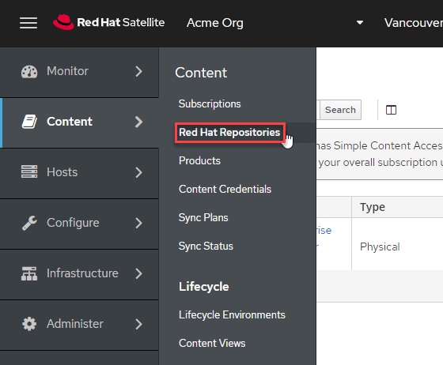

Inter-Satellite Sync (ISS) network sync enables a downstream satellite server to synchronize data from an upstream satellite server instead of the Red Hat content delivery network (CDN). The benefit of this feature is simplifying environments where network separation is required to segregate infrastructure from direct connections to the internet. ISS network sync is useful where DMZ topologies are required.

ISS network sync configuration consists of the following.
1) An upstream satellite server (`satellite.lab`) synchronizing software from the Red Hat CDN.
2) A downstream satellite server (`satellite-2.lab`) configured to synchronize software from `satellite.lab`.

The downstream satellite server must contain a manifest with valid Red Hat subscriptions.

Import the ssl certificate from satellite.lab
=============================================

In order to secure the synchronization process between upstream and downstream satellite servers, we need to import the upstream (`satellite.lab`) SSL certificate into the downstream satellite server (`satellite-2.lab`).

Enter the following command into the `Satellite Server 2` terminal.

```
wget -P ~ http://satellite.lab/pub/katello-server-ca.crt
```
This command will download the `katello-server-ca.crt` from `satellite.lab` to `satellite-2.lab`.

Next, in the `Satellite Server 2` terminal, use the following command to import the certificate.

```
hammer content-credential create \
--content-type cert \
--name "satellite.lab" \
--organization "Acme Org" \
--path ~/katello-server-ca.crt
```

Configure the downstream satellite server to use the upstream satellite server as a CDN
=======================================================================================

In the `Satellite Server 2 Web UI`, log in with the following credentials.

Username
```
admin
```

Password
```
bc31c9a6-9ff0-11ec-9587-00155d1b0702
```

Make sure that the organization is set to `Acme Org` and the location is set to `Kicking Horse`.


Navigate to `Subscriptions`.


Click `Manage Manifest`.


Click the tab `CDN Configuration`.


Click `Network Sync`.


Perform the following tasks.
1) Enter the url for satellite.lab.
```
https://satellite.lab
```
2) Enter the username `admin`.
```
admin
```
3) Enter the following password.
```
bc31c9a6-9ff0-11ec-9587-00155d1b0702
```
4) Enter the organization `Acme_Org`
```
Acme_Org
```
5) Choose the SSL CA Content Credential `satellite.lab`.
6) Click `Update`.
7) Click `Close`.


Verify that satellite-2.lab can synchronize software from satellite.lab
=======================================================================

Navigate to the `Red Hat Repositories` menu.



Click on the `Recommended Repositories` slider to change it to `ON`.


Select the `Red Hat Enterprise Linux 9 for x86_64 - BaseOS RPMs 9` repository.


It is possible to select this repository because it has been provided by the upstream satellite server `satellite.lab`.

If we select another repository that hasn't been synchronized, a message would display `No repositories available`.


Navigate to the Products menu.


Sync all the products.


Optional self-directed exercise for the reader
================================

Deregister rhel1.lab from satellite.lab and register it to satellite-2.lab and install software.