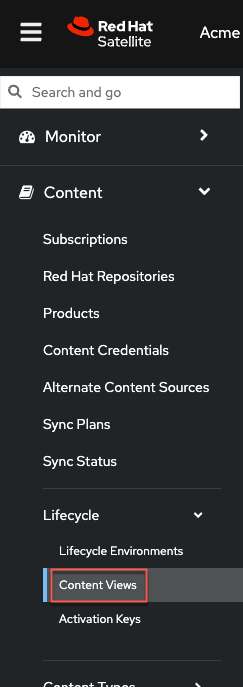

Introduction
===
In this challenge we'll create a Content view. Red Hat Satellite uses content views to create customized subsets of repositories from the full repositories synchronized to the Red Hat Satellite server. You can use content views to define which software versions a particular environment uses. For example, a production environment might use a content view containing older package versions, while a development environment might use a content view containing newer package versions.

Since this is a basic introduction to Satellite, we will only create a Content View for the purpose of providing content to RHEL hosts, without regard for test, production lifecycle use cases.

To learn more about Content Views and how to use them to manage content for different lifecycle environments, please see [Managing Content Views](https://access.redhat.com/documentation/en-us/red_hat_satellite/6.15/html/managing_content/managing_content_views_content-management) in Satellite documentation.

Create a content view
===
Click on `Content Views`.



Click on `Create New View`.


We'll name this content view `RHEL9`:

```bash
RHEL9
```

Click `Create content view` to save it.

>[!NOTE]
>Please ensure that you type `RHEL9` in capital letters. We'll need this value in step 6 of this lab.


Click on `Show repositories`.


Add the `Red Hat Enterprise Linux 9 BaseOS` and `Red Hat Enterprise Linux 9 AppStream` repos. Click `Add Repositories`.


Click `Publish New Version`.


Next we'll complete the following steps to publish and promote the content view.

1) Click the sliding `Promote` button.

2) Select the lifecycle environment you wish to promote the content view to. In this case it is `Test`.

3) Click `Next` to review the task.


Review the details and then click `Finish`.
