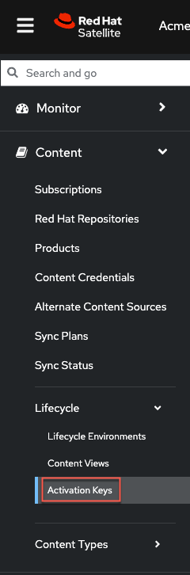
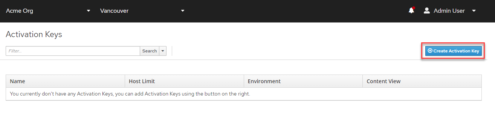
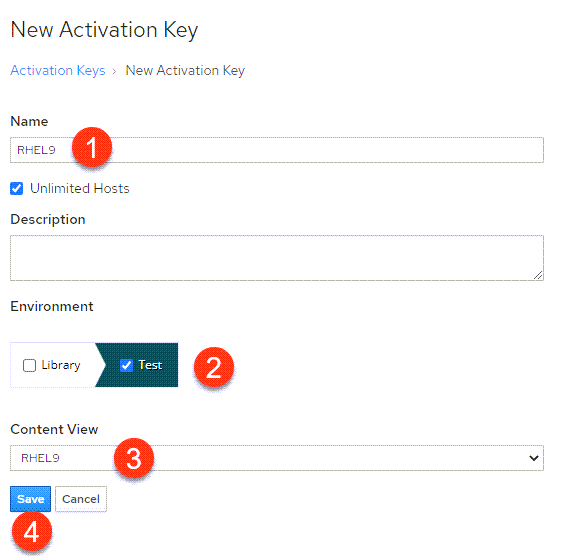
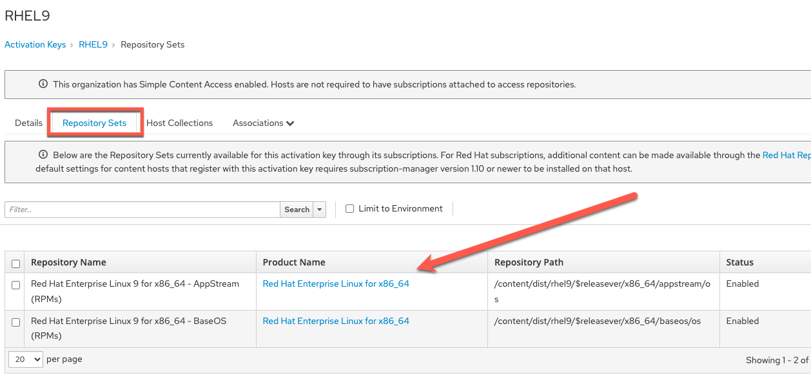

Introduction
===
Activation keys provide a method to automate system registration. You can create multiple keys and associate them with different attributes to assign to hosts. For example, you might create a basic activation key that enables certain Red Hat repositories and associate it with the appropriate content view environments.

You can use activation keys during content host registration to improve the speed, simplicity and consistency of the process. Note that activation keys are used only when hosts are registered. If changes are made to an activation key, it is applicable only to hosts that are registered with the amended activation key in the future. The changes are not made to existing hosts.

Create an activation key
===
To create an activation key, navigate to the `Activation Keys` menu.



Click on `Create Activation Key`.



We'll name this activation key (1) `RHEL9`, select the (2) `Test` environment, select the (3) `RHEL9` content view and then click (4) `save`.

For your cut/paste convenience:

```bash
RHEL9
```
> [!NOTE]
> The name of the activation key will be used to add hosts. The names must match or the hosts will not be registered.



If you click on `Repository Sets`, you'll notice that this Activation Key provides access to the RHEL 9 AppStream and BaseOS repositories. This access is provided by configuring the Activation Key to use the `RHEL9` Content View.


