<!-- markdownlint-disable MD033 MD029-->

Often when software is updated, services on a host must be restarted before the new software can run. The tracer utility can detect when a service needs to be restarted, and notify you through Red Hat Satellite.

To demonstrate this capability, we'll install the `katello-host-tools-tracer` package on our hosts through remote execution. We'll perform the following tasks:

1) Synchronize the `Satellite client 6` repository to our Satellite server.

2) Make the repository available to our hosts by adding it to our `RHEL9` content view.

3) Install `katello-host-tools-tracer` on our hosts.

Add the Satellite client repository
===================================

> [!IMPORTANT]
> This section is for your documentation purposes. This step has already been performed for you. Read over this section and proceed to the next step.

Go to `Content` and click on `Red Hat Repositories`.

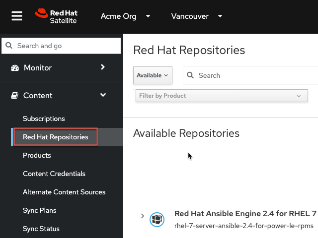

Next add the `satellite-client-6-for-rhel-9` repository.

1) Paste the following into the search bar.

```bash
satellite-client-6-for-rhel-9
```

2) Click the `+` symbol.

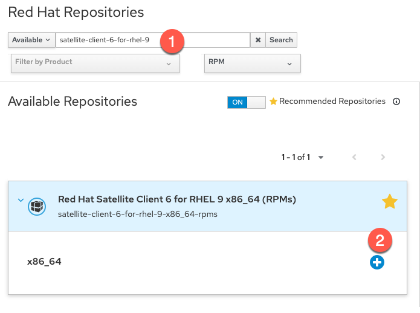

Synchronize the Satellite client repository
===========================================
> [!IMPORTANT]
> This section is for your documentation purposes. This step has already been performed for you. Read over this section and proceed to the next step.

Next, we'll navigate to the `Products` menu.

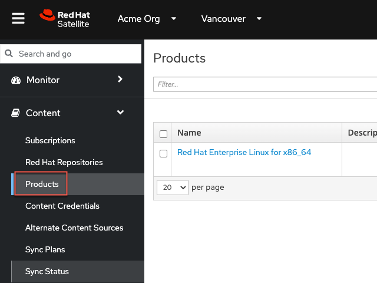

Click on `Red Hat Enterprise Linux for x86_64`.

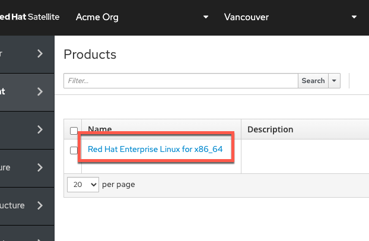

Do the following to synchronize the repository with Satellite.

1) Select `Red Hat Satellite Client 6 for RHEL 9 x86_64 RPMs`.

2) Click `Sync Now`.

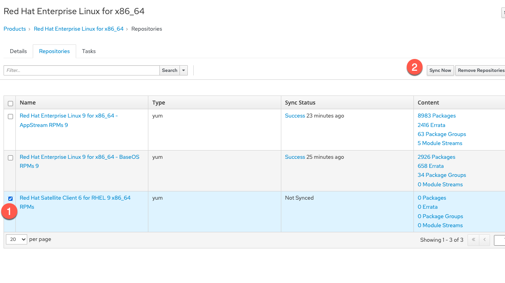

Add the Satellite client repository to the RHEL9 content view
===
Now that the repository containing the Tracer application is synchronized to Satellite, we'll make it available to our hosts by adding and enabling the repository in our existing `RHEL9` content view.

Navigate to `Content Views`.

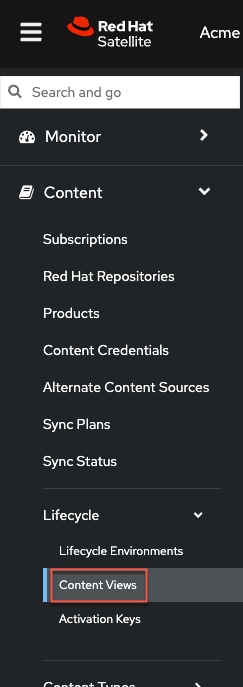

Click on the `RHEL9` content view.

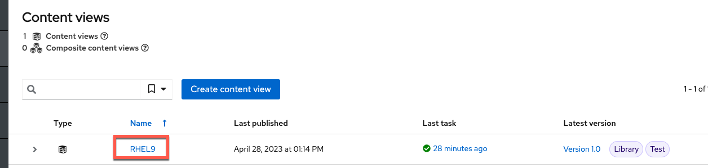

Click on the `Repositories` tab.


Select `All` from the `Status` dropdown to unhide the Satellite tools repository.
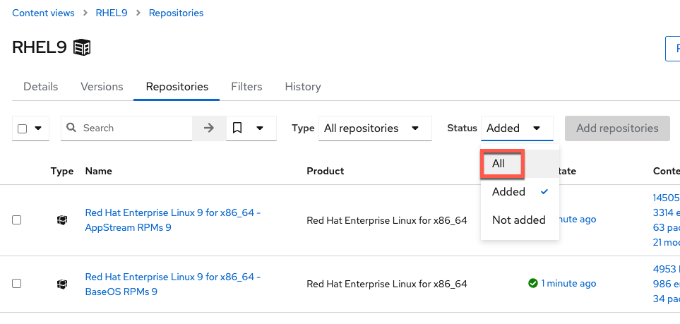

Add the repo.

1) Select the repo `Red Hat Satellite Client 6 for RHEL 9 x86_64 RPMs`.

2) Click `Add repositories`.

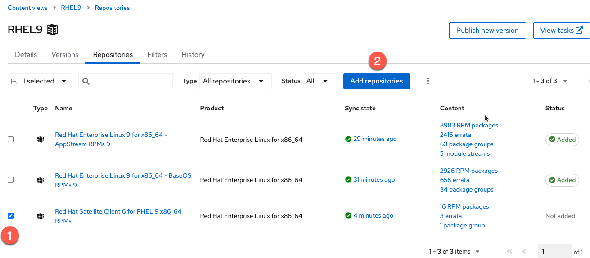

Click `Publish new version`.

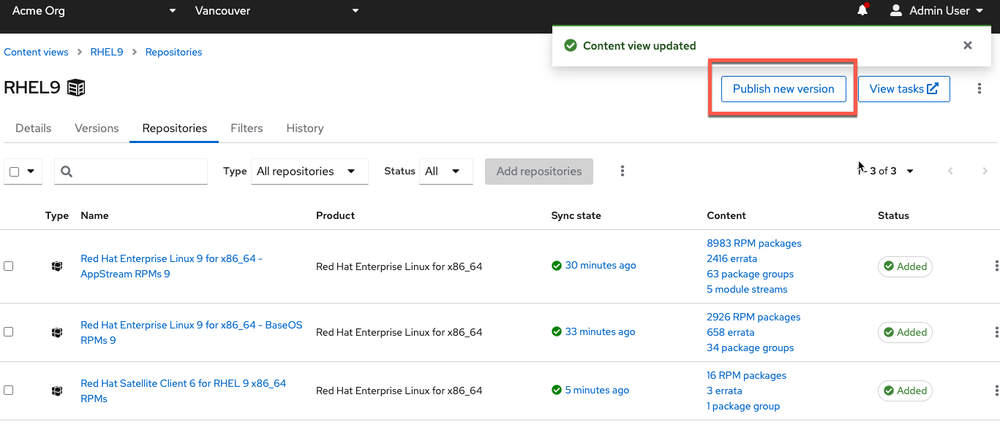

We'll now publish a new version of the content view.

1) Add a description to the new version of the content view. In this example we added `Added the Satellite Client 6 repo.`.

2) Click `Promote`.

3) Click on the `Test` lifecycle environment.

4) Click `Next`.

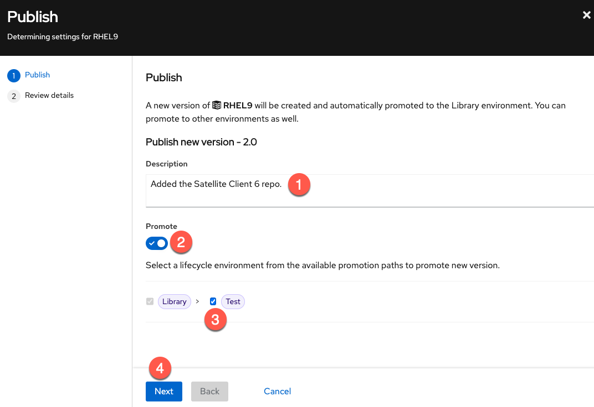

Click `Finish`.

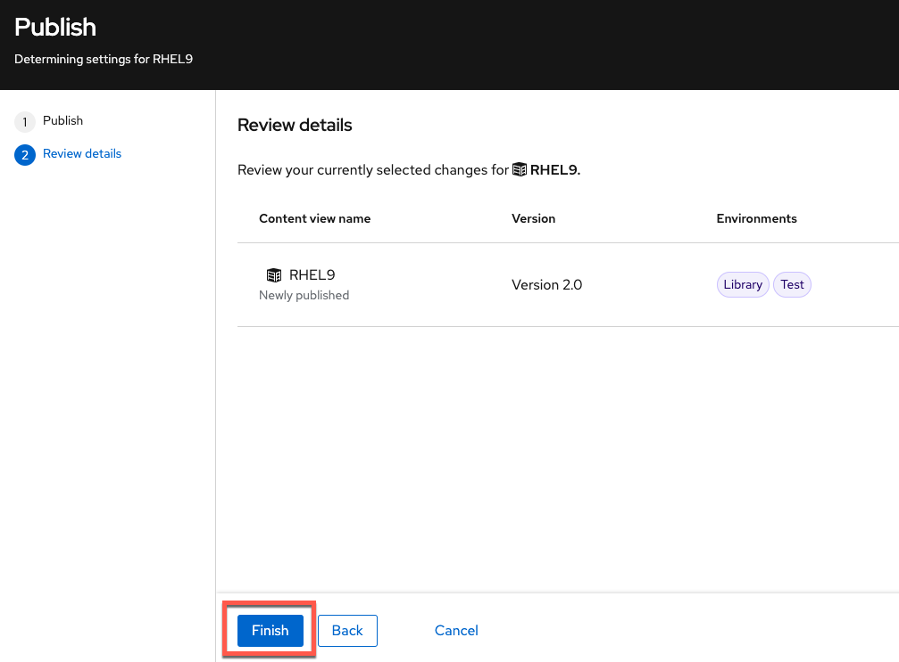

Enable access to the Satellite client repository
===
Now we'll enable access to the `Red Hat Satellite Client 6 for RHEL 9 x86_64 RPMs` repo by specifying it in the `Activation Key`. When new hosts are added, they will automatically receive access to the enabled repository so that Tracer can be installed.

With existing hosts, there is one extra step which we'll cover in this challenge.

First, navigate to `Activation Keys`.


Click on the `RHEL9` activation key.

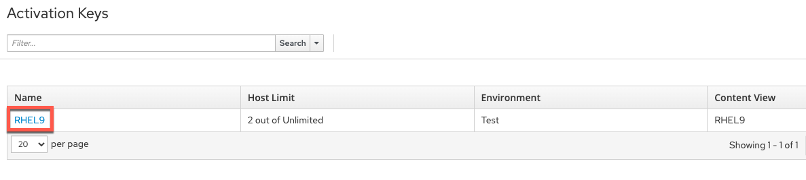

Click on `Repository Sets`.

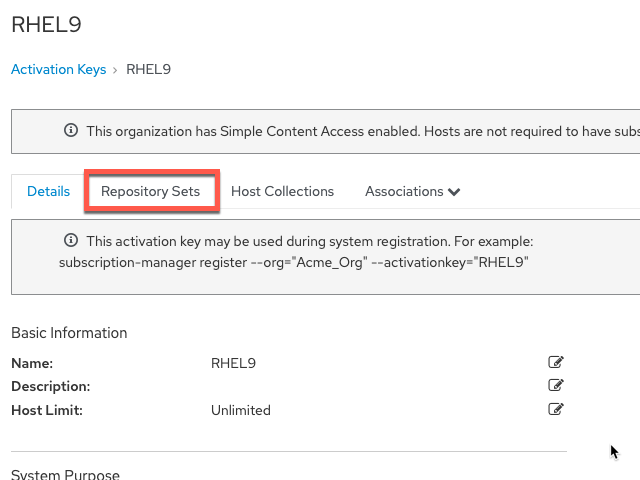

Override the `Red Hat Satellite Client 6 for RHEL 9 x86_64 RPMs` repository to `Enabled`.

1) Select the `Red Hat Satellite Client 6 for RHEL 9 x86_64 RPMs` repository.

2) Click `Override to Enabled`.

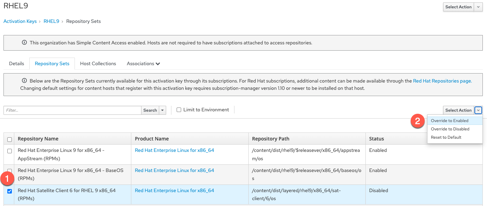

Install Tracer on existing hosts managed by Satellite
===

Here's the extra step we'll need to perform to enable access to the Tracer app for our existing hosts. New hosts added after this step will automatically get access.

Go back to the `All hosts` menu.


1) Select your hosts (rhel1 and rhel2).

2) Click `Select Action`.

3) Select `Schedule Remote Job`.

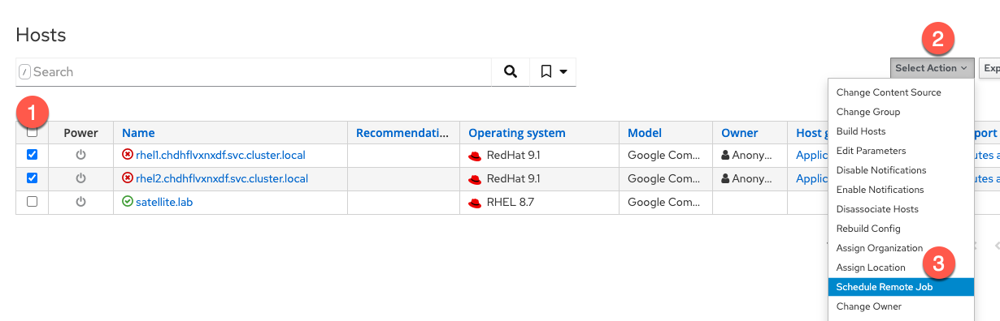

In the `Category and Template` menu, click `Next`.

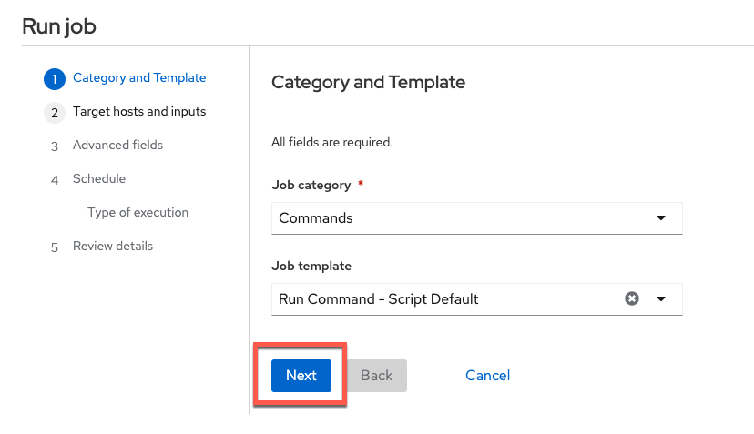

In the `Target hosts and inputs` menu, do the following.

1) Paste this command. It will enable the Satellite 6 client repo and install the Tracer software.

```bash
dnf config-manager --set-enabled satellite-client-6-for-rhel-9-x86_64-rpms && dnf install -y katello-host-tools-tracer
```

2) Click `Run on selected hosts`.
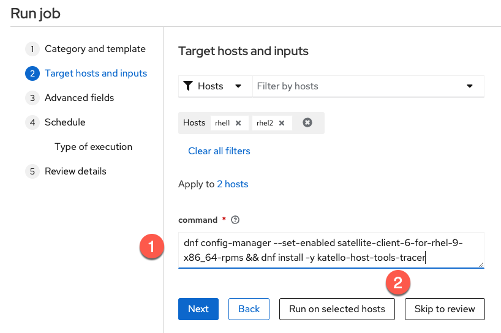

<!-- Navigate to `All hosts`.


1) Select the two new hosts.

2) Click `Schedule Remote Job`.

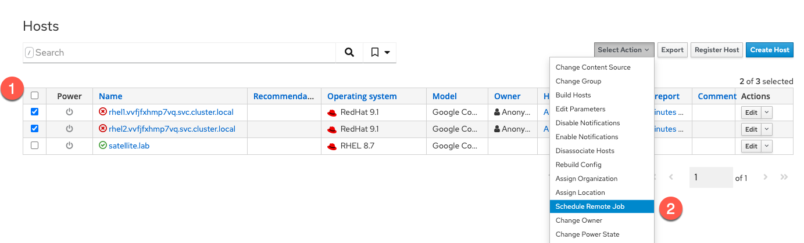 -->

<!-- We can now install `katello-host-tools-tracer` on our hosts.

In the `Job invocation` menu, do the following.

1) Paste the following command to install `katello-host-tools-tracer`.

```bash
dnf install -y katello-host-tools-tracer
```

2) Click `Submit`.

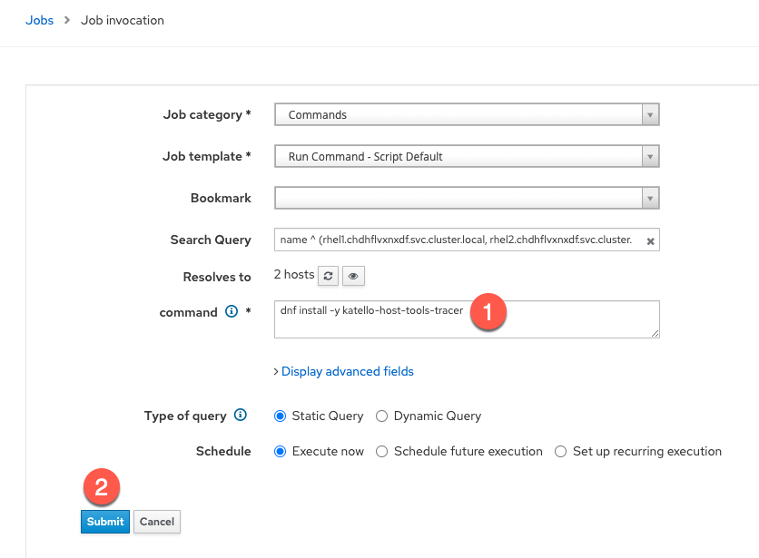 -->

Tracer is now installed. We'll see how it will help us in the next challenge, where we apply errata updates.

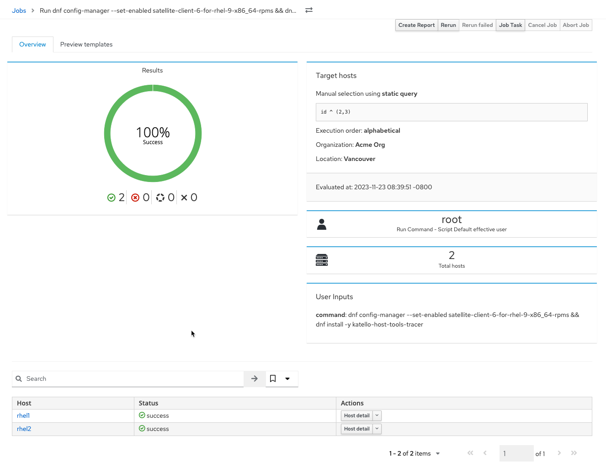
