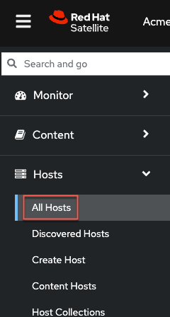
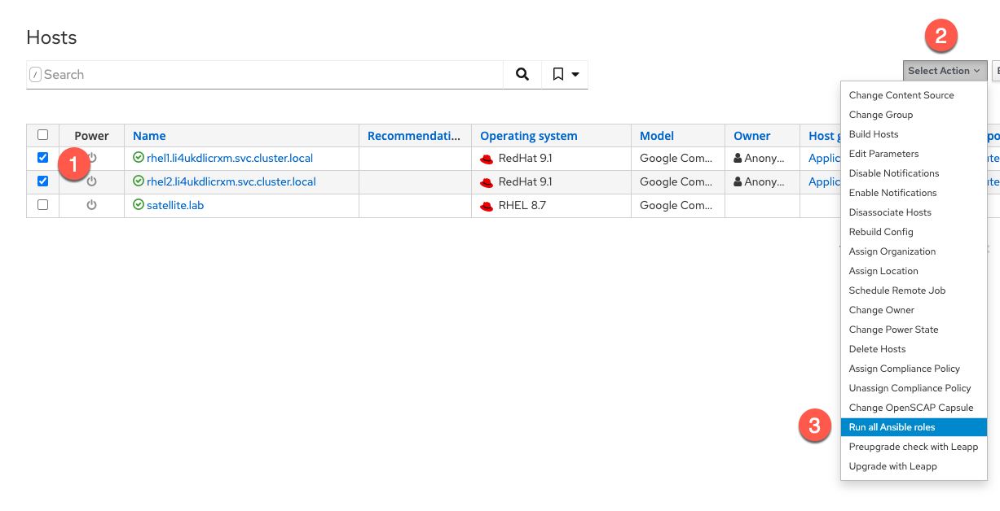
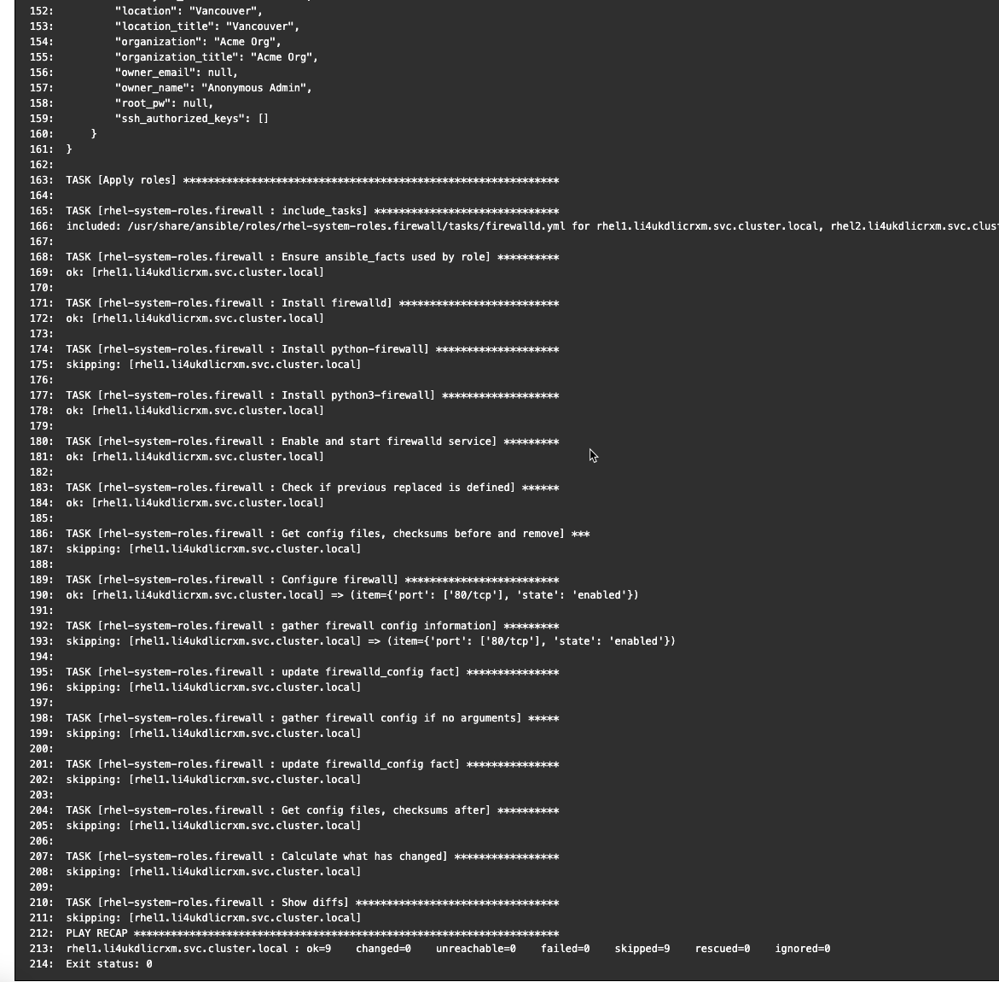
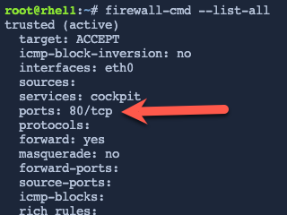

Introduction
===
>[!NOTE]
>Before starting this challenge, make sure that your hosts have finished rebooting from the previous challenge. You can easily check by clicking on the terminal tab to check that you have a working session with each host. 

Earlier, we configured the our host group to have a system role applied to it. Specifically, port 80/tcp was to be opened. You can find out more about [RHEL System Roles here](https://access.redhat.com/articles/3050101).

Once again, navigate to `All Hosts`.



Next we'll do the following.

1. Select both hosts.

2. Click `Select Action`.

3. Select `Run all Ansible roles`.



In the `Overview` menu you'll be shown the status of the jobs.


If you want, click on a host to view the application of the system role.



You can verify that port 80/tcp has been opened by doing the following.

Click on one of these buttons for [button label="rhel1" background="#ee0000" color="#c7c7c7"](tab-2) **or** [button label="rhel2" background="#ee0000" color="#c7c7c7"](tab-4).


Run the following command.

```bash,run
firewall-cmd --list-all
```


