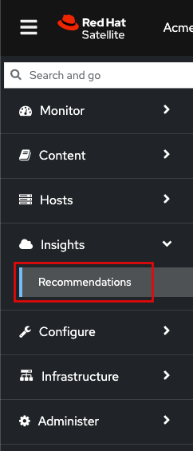
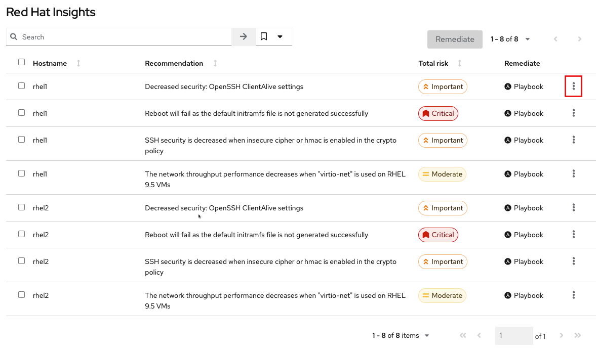
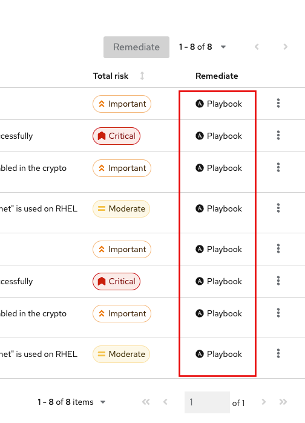
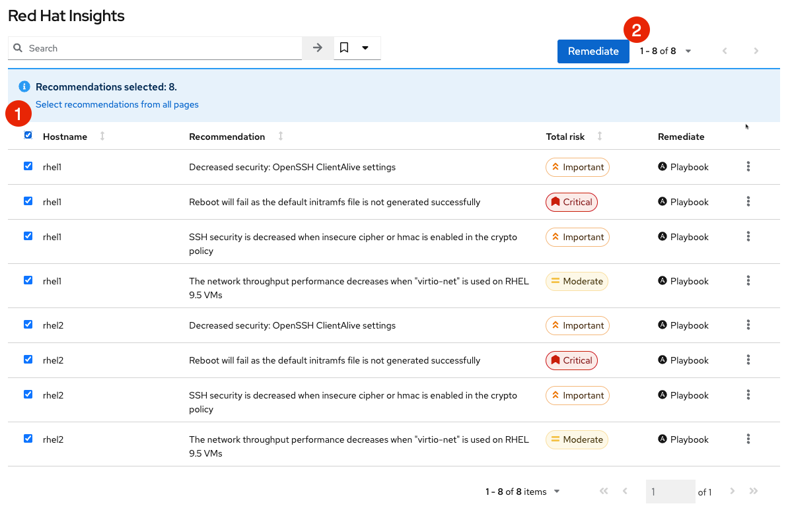
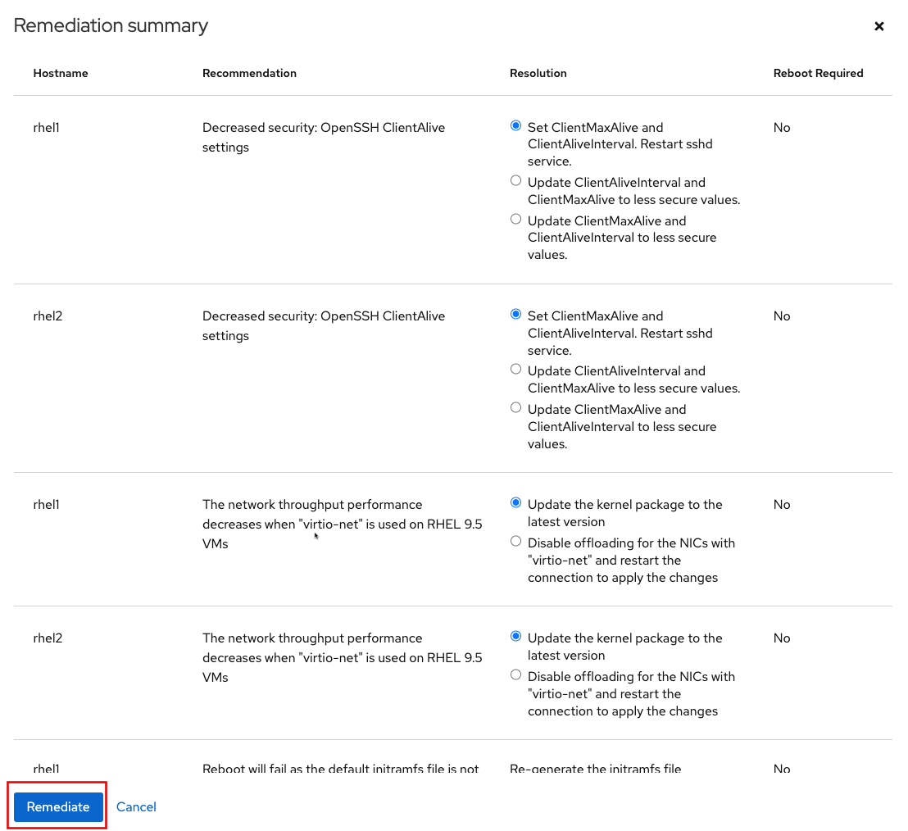
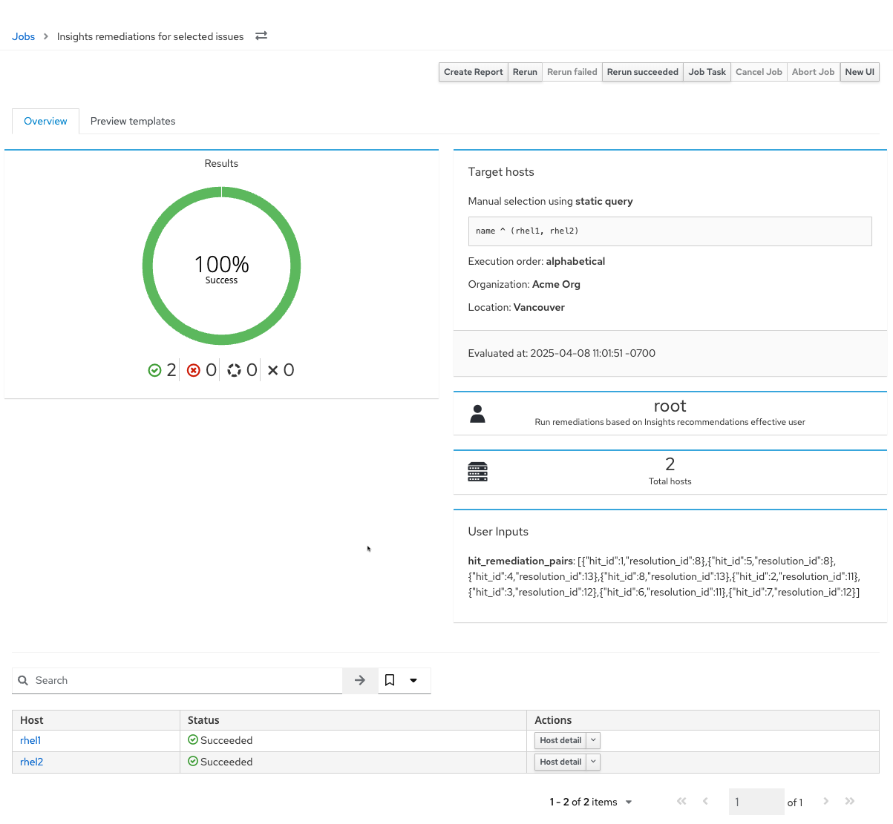

Red Hat Insights continuously analyzes platforms and applications to predict risk, recommend actions, and track costs so enterprises can better manage hybrid cloud environments.

Insights advisor analyzes Red Hat Enterprise Linux systems for configuration problems that could degrade performance or render your system less secure. Red Hat Satellite provides access to the Insights advisor service in a connected and disconnected network topology. In this assignment we'll review how to use Insights advisor in a disconnected environment to analyze problems and remediate automatically.

Review Insights advisor recommendations
===
Navigate to the `Recommendations` menu.

In this menu we can see all the Insights advisor `Recommendations` for each host. Click on the "kebab" button to review the knowledge base article associated with an advisory.

Notice that each of these recommendations has an ansible playbook to remediate the the detected problem.

Automatically remediate the hosts
===

Let's remediate all the problems found by Insights advisor.
1) Select all recommendations.
2) Click `Remediate`.

Review all the remediations and click `Remediate`.

When all remediations have been applied, proceed to the next assignment.

