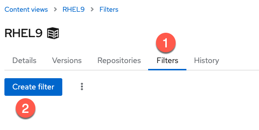
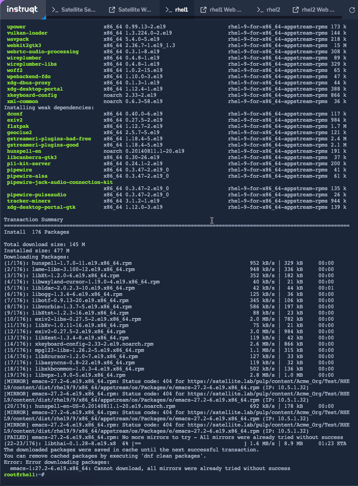

<!-- markdownlint-disable MD033 -->

Go to the Content Views menu.


Do the following.

1) Click on the `Filters` tab.
2) Click `Create filter`.



Create a filter with the following steps.

1) Name the filter `emacs`.
2) Select `Exclude filter`.
3) Give the filter a description. We're going to exclude emacs from being included in the `RHEL9` content view.
4) Click `Create filter`.


Next, click `Add RPM rule`.


Configure your RPM rule in the following way.

1) Since we're filtering `emacs`, enter `emacs`.
2) Select `All versions`.
3) Click `Add rule`.


Click `Publish new version` to publish a new version of the `RHEL9` content view containing our new `emacs` filter. The new content view will make `emacs` unavailable for hosts to install.

1) Add a description to the content view version. In this case, `added emacs filter`.
2) Select `Promote`.
3) Select the `Test` lifecycle environment.
4) Click `Next`.


Ensure the details of this new version are correct and then click `Finish`.

Next, go into the terminal of one of the hosts and enter the following.

```bash
dnf install -y emacs
```



Now all your users will be forced to use vim.
