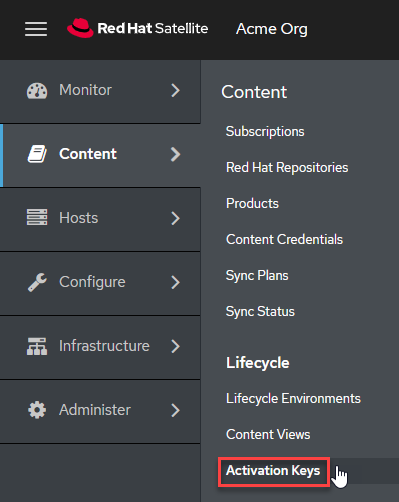
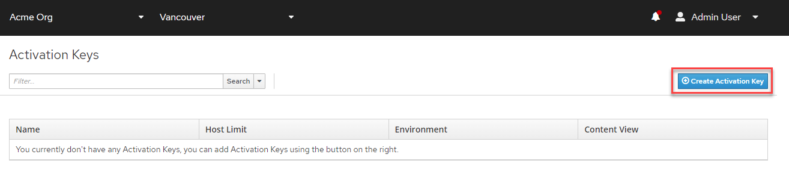
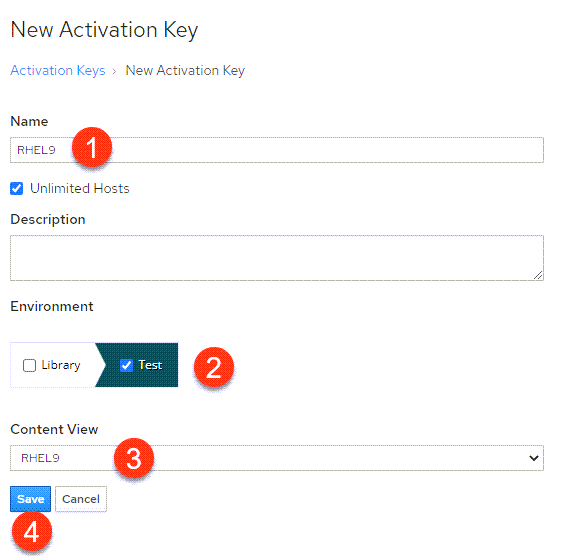

<!-- markdownlint-disable MD033 -->

Activation keys provide a method to automate system registration and subscription attachment. You can create multiple keys and associate them with different environments and Content Views. For example, you might create a basic activation key with a subscription for Red Hat Enterprise Linux workstations and associate it with Content Views from a particular environment.

You can use activation keys during content host registration to improve the speed, simplicity and consistency of the process. Note that activation keys are used only when hosts are registered. If changes are made to an activation key, it is applicable only to hosts that are registered with the amended activation key in the future. The changes are not made to existing hosts.

To create an activation key, navigate to the `Activation Keys` menu.

Click on `Create Activation Key`.

We'll name this activation key (1) `RHEL9`, select the (2) `Test` environment, select the (3) `RHEL9` content view and then click (4) `save`.

> __NOTE__: The name of the activation key will be used in the next step of this lab to add hosts. The names must match or the hosts will not be registered.

