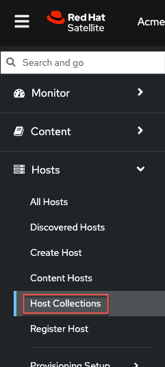
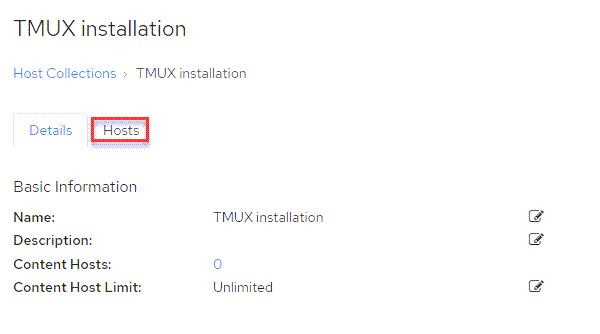
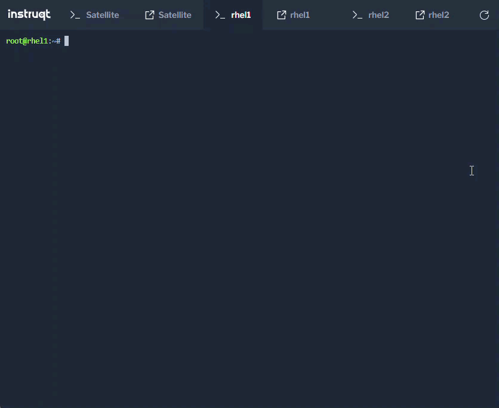

Introduction
===
We'll install software on multiple hosts simultaneously, using a Host Collection.

A host collection is a group of content hosts. This feature enables you to perform the same action on multiple hosts at once. These actions can include the installation, removal, and update of packages and errata, change of assigned life cycle environment, and change of Content View. You can create host collections to suit your requirements, and those of your company. For example, group hosts in host collections by function, department, or business unit.

For more information on Host Collections, please see [Configuring Host Collections](https://access.redhat.com/documentation/en-us/red_hat_satellite/6.15/html/managing_hosts/configuring_host_collections_managing-hosts).

Create a host collection
===

First we'll create a Host Collection. Click on `Host Collections` in the menu.



Click `Create Host Collection`.


Next, do the following:

1) Name the `Host Collection`. In this case we'll name it `TMUX installation`.
2) Click `Save`.


Click on `Hosts`.



Click on `Add`.


Select the hosts we want to install `tmux` on, then click `Add Selected`. In this example we will install `tmux` on `rhel1` and `rhel2`.


Click on the `Details` tab.


Install software with the host collection
===

Click on `Package Installation, Removal, and Update`.


Do the following:

1) Type in the package name. In this case we'll install `tmux`.

2) Click `install`.

3) Click `yes`.


You'll be taken to the job status page.


You can check on the real-time installation progress by clicking on a host.


When the installation has completed, click on one of these buttons for [button label="rhel1"](tab-2) **or** [button label="rhel2"](tab-3) and run the command `tmux`.

```bash,run
tmux
```

tmux is a terminal multiplexer. It lets you switch easily between several programs in one terminal, detach them (they keep running in the background) and reattach them to a different terminal. [tmux documentation is available here](https://github.com/tmux/tmux/wiki).


