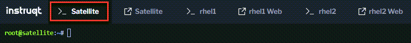
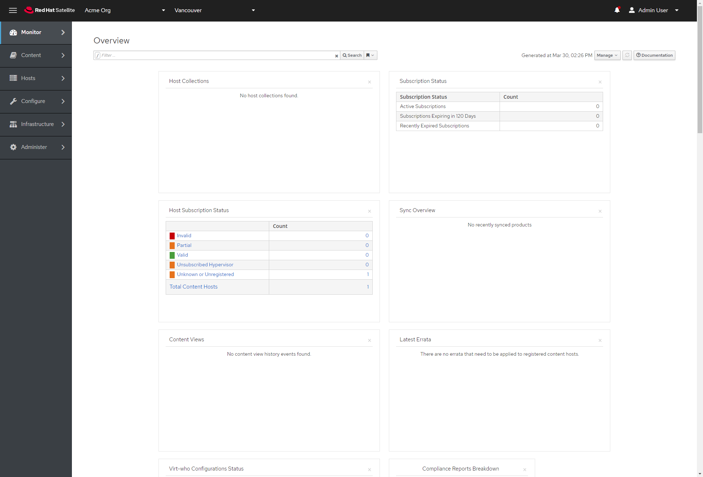

<!-- markdownlint-disable MD033 -->
The lab environment consists of the following

- 1 Red Hat Satellite 6.10 Server (Satellite is preinstalled)
- 2 Red Hat Enterprise Linux 8.5 hosts.


>_NOTE:_ To make the inline images larger, expand this window.


## <ins>Log into the Web UI</ins>

First, we'll log into the Red Hat Satellite Web User Interface (UI). Satellite has been preinstalled and installation is out of scope for this lab.

Click on the tab labelled Satellite Web UI as shown in the image below.



A new tab will open in your web browser stating the connection is insecure. This lab has been authored and tested with Google Chrome so please try that it if doesn't load properly.

Ignore the security message about insecure connections by clicking on `Advanced`.


Next click on `Proceed`.


You'll need the following credentials to log into the Satellite Web UI.

```text
Username: satadmin
Password: bc31c9a6-9ff0-11ec-9587-00155d1b0702
```

You can copy and paste each of them below.

```bash
satadmin
```

```bash
bc31c9a6-9ff0-11ec-9587-00155d1b0702
```

Now click `Log In`.


You will be taken to the main dashboard.



## <ins>Access the RHEL Hosts</ins>

At the top of the screen, you'll find tabs for the hosts `rhel1` and `rhel2`. Terminal and Web Console access are provided.


The credentials for these hosts are the following:

Username:

```bash
rhel
```

Password:

```bash
redhat
```
