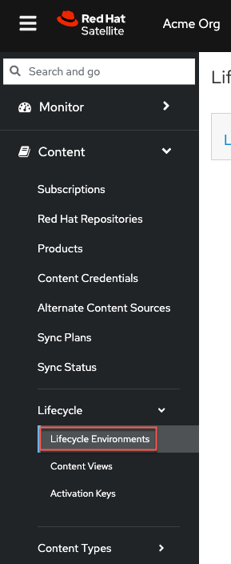

<!-- markdownlint-disable MD033 -->

## <ins>Create a new lifecycle environment</ins>

The application life cycle is a concept central to Red Hat Satellite 6’s content management functions. The application life cycle defines how a particular system and its software look at a particular stage. For example, an application life cycle might be simple; you might only have a development stage and production stage. In this case the application life cycle might look like this:

- Development
- Production

However, a more complex application life cycle might have further stages, such as a phase for testing or a beta release. This adds extra stages to the application life cycle:

- Development
- Testing
- Beta Release
- Production

To find out more about lifecyce environments, please refer to [Satellite documentation](https://access.redhat.com/documentation/en-us/red_hat_satellite/6.11/html/managing_content/creating_an_application_life_cycle_content-management.)

Navigate to the `Lifecycle Environments` menu.

Click on `Create Environment Path`.

Create a new environment. We'll call this one `test`. Then click `save` to save it.

The `Lifecycle Environment Paths` menu should look like this.

