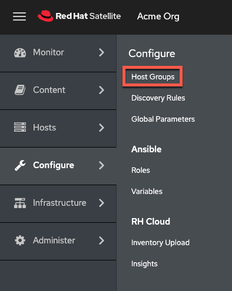
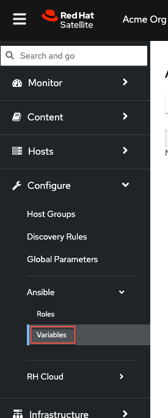

<!-- markdownlint-disable MD033 MD029-->

Red Hat Satellite provides several logical units for grouping hosts. Hosts that are members of those groups inherit the group configuration. It is recommended to configure the majority of settings at the host group level instead of defining hosts directly. Configuring a new host then largely becomes a matter of adding it to the right host group. As host groups can be nested, you can create a structure that best fits your requirements.

For more information on Host Groups, please see the [documentation](https://access.redhat.com/documentation/en-us/red_hat_satellite/6.12/html/satellite_overview_concepts_and_deployment_considerations/chap-architecture_guide-host_grouping_concepts).

We'll create a host group that applies a Red Hat Enterprise Linux System Role to configure the firewall to allow incoming connections through port 80/tcp.

Navigate to the `Configure` and `Host Groups` menu.



Click on `Create Host Group`.


In the host group menu do the following:

1) Name the host group `Application Servers`.
2) Select the `Test` lifecycle environment.
3) Select the `RHEL9` content view.
4) Select `satellite.lab` as the content source.
5) Click on `Ansible Roles`


In the Ansible Roles menu do the following:

1) Navigate to the second page of system roles.
2) Click on `rhel-system-roles.firewall`.
3) Click on `Parameters`.


We need to tell the firewall system role to allow incoming connections to port 80/tcp.
In the Parameters menu do the following:

1) Click `Add Parameter`.
2) Name the parameter `firewall`.
3) Choose the type `array`.
4) Copy and paste the following into the `value` field.

```json
[{"port":["80/tcp"],"state":"enabled"}]
```

_**NOTE:**_ This property is a JSON format version of the YAML ansible properties found in an ansible playbook.

5) Click `Activation Keys`.


_**NOTE:**_ `Host Group Parameters` are variables that can be applied by RHEL System Roles or Ansible Roles. You can find a list of available variables by clicking on Configure > Ansible > Variables. `Host Group Parameters` can help you configure subsets of hosts using RHEL System Roles with different variables, according to your requirements.



We will assign the `RHEL9` activation key to this group.

1) Under `Activation Keys` enter `RHEL9`.
2) Click on `Submit`.


