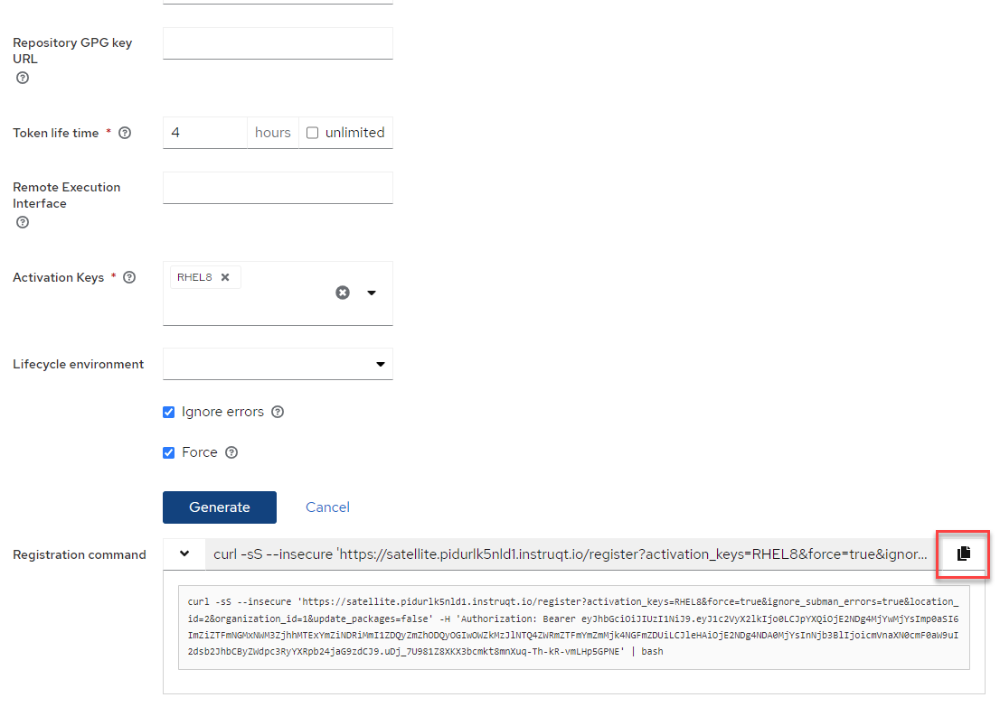

<!-- markdownlint-disable MD033 -->

Navigate to the `Register Host` menu.

Check the `Insecure` check box then click on `Advanced`.

Next, select the `RHEL8` activation key, check `Ignore errors`, check `Force`, and then click `Generate`.

After clicking `Generate`, a curl command will be generated. Copy and paste this command by clicking on the copy icon.

Go into the terminal of one of the rhel hosts (rhel1 or rhel2) and paste this command.

>_NOTE:_ You may need to click on the refresh button to revive the terminal. 

When `rhel1` is registered, the following message will display in the terminal.

In the Satellite Web UI, navigate to `All Hosts` to view the newly registered host.

You can check that your host repos are configured for the Satellite server by entering the following `cat /etc/yum.repos.d/redhat.repo`

Finally, you can update your host by entering `dnf update`.

After updating the host, the status should turn green.

