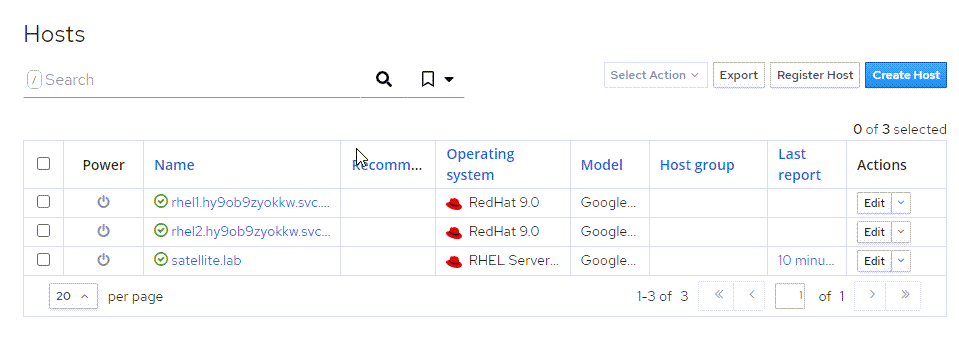

<!-- markdownlint-disable MD033 -->

Red Hat Product Errata are contain advisories on bug fixes, security, and enhancement on software installed on your RHEL host, based on analysis by Red Hat engineers. Red Hat Satellite provides a simple method for applying these fixes to hosts. We'll walk through those steps.

For more information on Red Hat Errata, [please visit this page](https://access.redhat.com/articles/2130961).

To view Errata in Satellite, click on `Content` and `Errata`.

You'll be taken to a page containing all the Errata contained in the repositories we originally synchronized in the second challenge of this lab.

Not all of these Errata apply to the hosts we've added to this Satellite server. To view applicable and installable Errata, click on the `Applicable` and `Installable` radio boxes.

Let's install all the applicable Errata to our two hosts.

Select all of the Errata we just filtered.

You'll be taken to the Apply Errata menu where you should do the following:

1) Select the hosts to apply the Errata. In this case we'll select all hosts.
2) Click `Next`.

To view the application of Errata in real-time, click on the host `rhel1`.

On the following page, you'll be able to see the application process.

To return to the job status page, click `Back to Job`.

When the job is complete, the page will look like this.

Go to Hosts > All Hosts.

All hosts managed by Satellite should display in a green font signifying all hosts are up to date and there are no errors logged.

