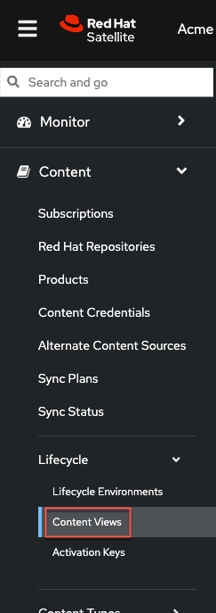

Introduction
===
A powerful feature of Content Views in Red Hat Satellite is the ability to filter content. This means that you can include or exclude content from being installed by your hosts. In this challenge, we'll block the installation of emacs with a filter (since it's bloatware).

Go to the Content Views menu.



Click on the `RHEL9` content view.


Do the following.

1) Click on the `Filters` tab.

2) Click `Create filter`.


Create a filter with the following steps.

1) Name the filter `emacs`.

2) Select `Exclude filter`.

3) Give the filter a description. We're going to exclude emacs from being included in the `RHEL9` content view.

4) Click `Create filter`.


Next, click `Add RPM rule`.


Configure your RPM rule in the following way.

1) Since we're filtering `emacs`, enter `emacs`.

2) Select `All versions`.

3) Click `Add rule`.


Click `Publish new version` to publish a new version of the `RHEL9` content view containing our new `emacs` filter.


The new content view will make `emacs` unavailable for hosts to install.

1) Add a description to the content view version. In this case, `added emacs filter`.

2) Select `Promote`.

3) Select the `Test` lifecycle environment.

4) Click `Next`.


Ensure the details of this new version are correct and then click `Finish`. Make sure to wait for the content view to finish publishing or else the filter won't work properly.
> [!WARNING]
> It can take up to 5 minutes for this particular task to complete publishing the content view.

Next, click on one of these buttons for [button label="rhel1"](tab-2) **or** [button label="rhel2"](tab-3) and run the following command.

```bash,run
dnf install -y emacs
```


Now all your users will be forced to use vim.
