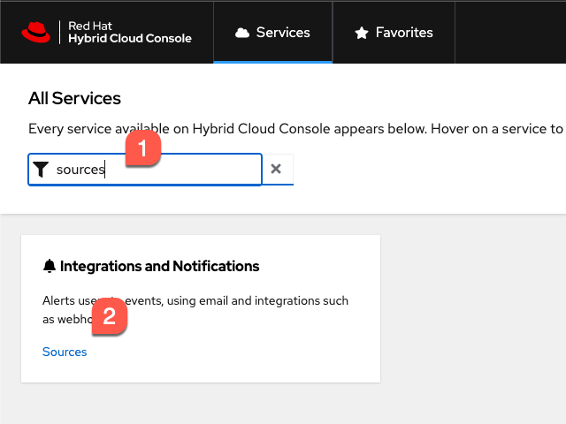
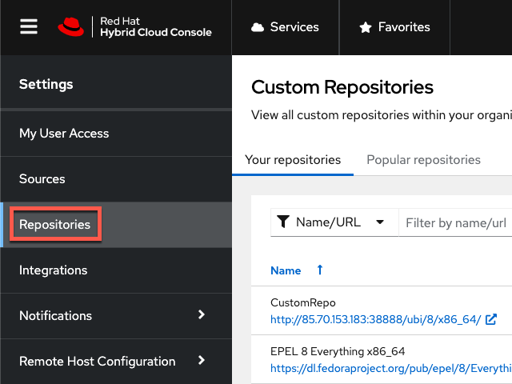
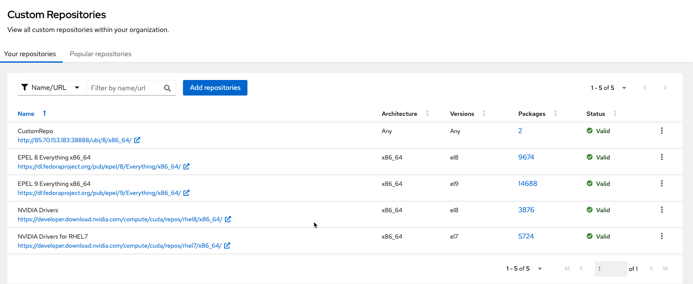
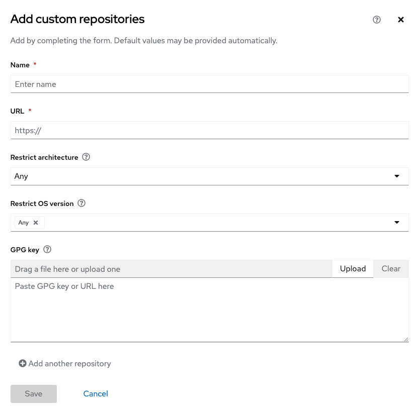

<!-- markdownlint-disable MD033 MD026-->

Let's navigate to the repositories menu.

Click on `Services`.

Next, we'll navigate to the `Sources` menu.

1) Type `Sources` in the search bar.
2) Click on `Sources`.

Click on `Repositories`

There are a few pre-configured repos.

**At this point, you may add a custom repository or proceed to the next step.**

If you would like to configure a custom repo, click on `Add repositories` and fill in the wizard below.

