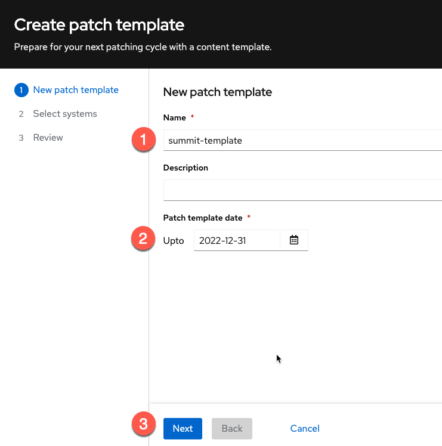
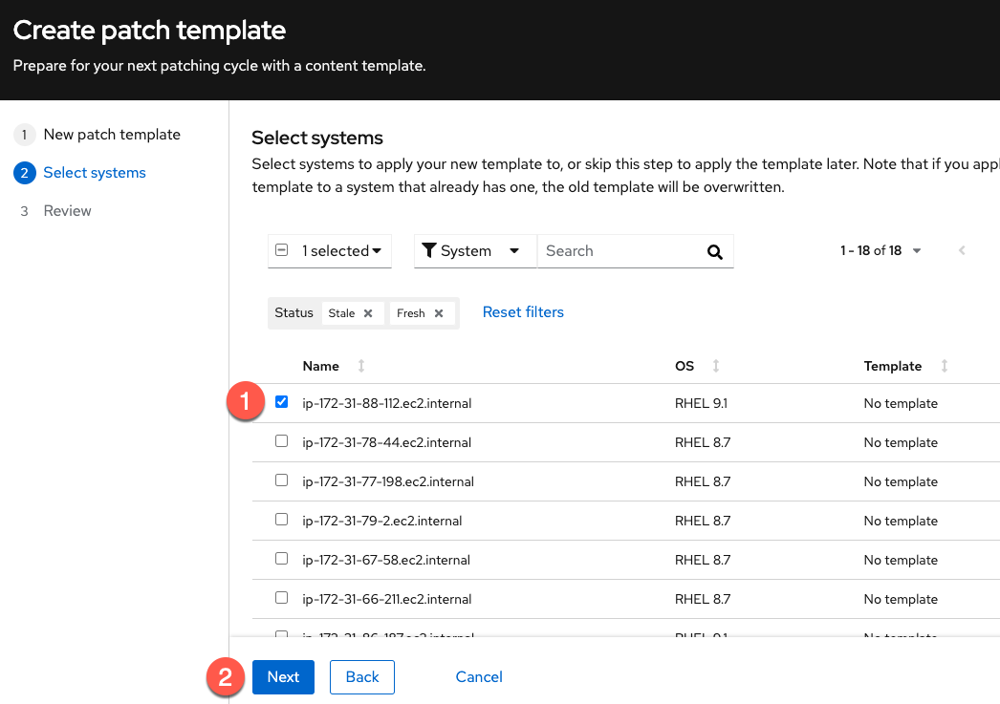
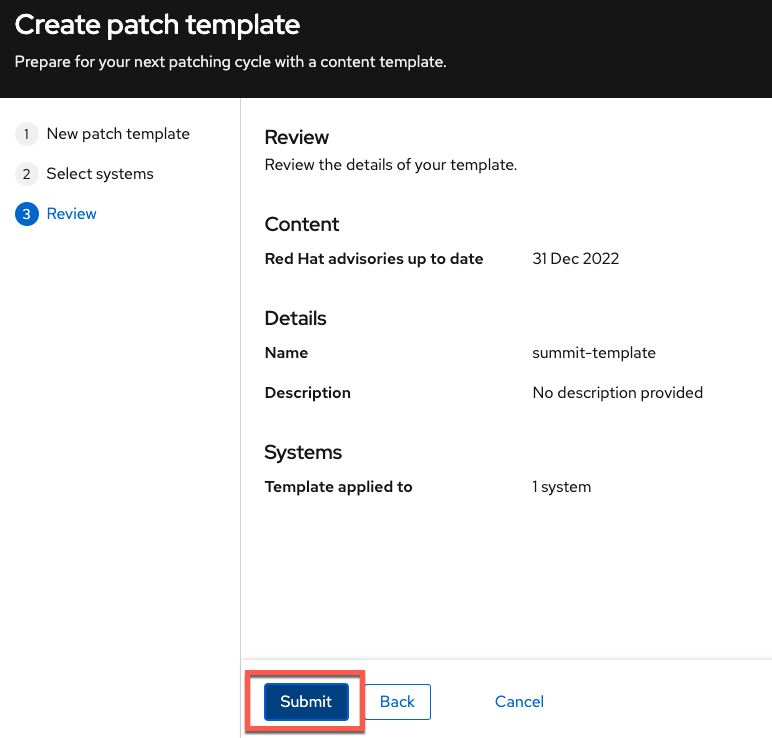

<!-- markdownlint-disable MD033 MD026-->

We will now patch our system with patches that were published up to December 31 by creating a patch template with a date of December 31, 2022. We'll

Go to the Patch template application.

Click the `Create a template` button.

Perform the following tasks in the `Create patch template` menu.

1) Give the template a name. In this example we'll name it `summit-template`.
2) Set the `Patch template date` to `2022-12-31`.
3) Click `Next`.

In the `Select systems` menu do the following.

1) Select the host you just launched in AWS.
2) Click `Next`.

Click `Submit`.

Once the template has been created, go back to the System view in the Patch application, and click on your system, based on the private  IP address / hostname.  Note that it reports that it is using the Patch template you created, and that there are no applicable advisories or packages.  This is because the container-tools advisory was published after the date we specified in the Patch template.
