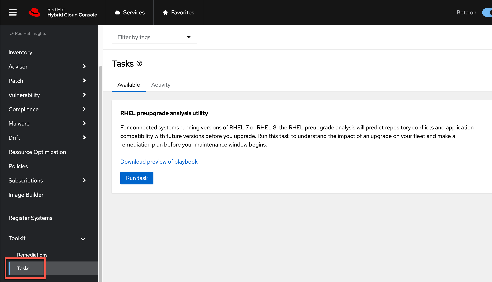
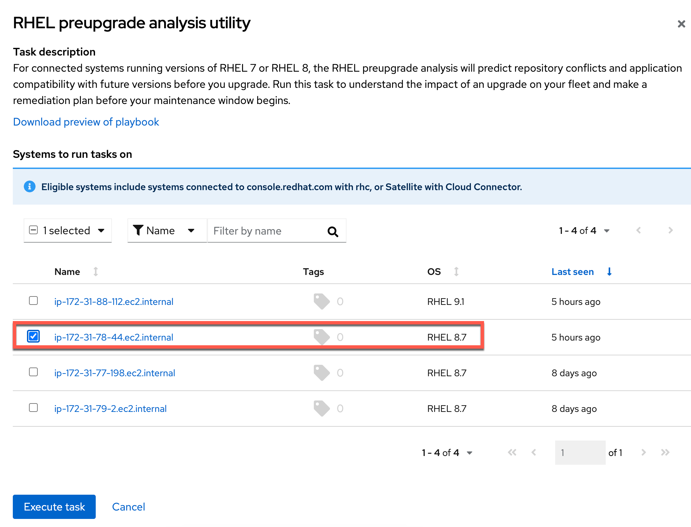
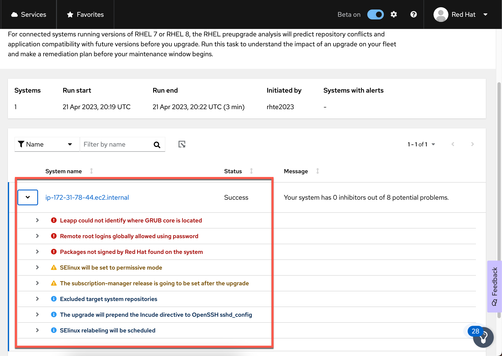

<!-- markdownlint-disable MD033 MD026-->

The RHEL preupgrade analysis utility analyzes RHEL8 and RHEL7 hosts to provide recommendations to minimize problems when upgrading to RHEL9.

Navigate to the `RHEL preupgrade analysis utility` in the `Tasks` menu under `Toolkit`.

Click on `Run task`.

Select a RHEL8 system and click execute.

It will take a few minutes for the job to complete.

Go to the `activites` tab and the last job run to view the analysis.

This completes all lab activities.
