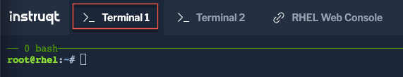
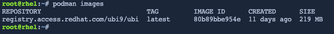
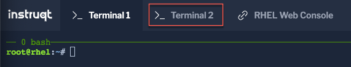

SELinux is a technology to isolate processes/containers running on the system to mitigate attacks which take advantage of privilege escalation. Udica is a new tool which complements the containers tools (Podman, Skopeo, Buildah, etc.) family supported by Red Hat to help improve the security of customers container environments.

>_NOTE:_ This lab assumes that you have a sound understanding of SELinux basics and container fundamentals.

Prior to getting started, we need certain packages such as Udica (which is a tool for generating SELinux policies for containers), and setools-console (which is a set of tools that can facilitate SELinux policy analysis). In this demo, the container runtime related packages are already installed.

Click on the `Terminal 1` tab.



Install the udica and setools-console packages on the container host

```bash
dnf install -y udica setools-console
```

Get the latest RHEL9 UBI image

```bash
podman pull registry.access.redhat.com/ubi9/ubi:latest
```

Use `podman` to list the available container images

```bash
podman images
```

</pre>
<a href="#example_image">
 
</a>

<a href="#" class="lightbox" id="example_image">
 
</a>

Click on click on the `Terminal 2` tab.



Create a container runtime using podman which passes in-container accesses to /home through to the host's /home read-only, passes in-container accesses to /var/spool through to the host's /var/spool read-write, and binds the host's port 80 to pass traffic to the container's port 80.

```bash
CONTAINER=$(podman run -v /home:/home:ro -v /var/spool:/var/spool:rw -d -p 80:80 -it registry.access.redhat.com/ubi9/ubi)
```

>_NOTE:_ The home directory is mounted with read-only access, and the /var/spool/ directory is mounted with read-write access.

Go back to `Terminal 1`.

Check the status of the application container using podman and get the running container id

```bash
podman ps; CONTAINERID=$(podman ps | grep registry.access.redhat.com | cut -b 1-12)
```

<pre class="file">
CONTAINER ID  IMAGE                         COMMAND               CREATED        STATUS           PORTS               NAMES
e47a11d3e2c5  registry.access.redhat.com/ubi9/ubi:latest  /bin/bash  3 seconds ago  Up 2 seconds ago0.0.0.0:80->80/tcp  naughty_golick
</pre>

When using SELinux, container processes get assigned a container type called 'container_t'. In `Terminal 1` Verify the SELinux type assigned to the running container.

```bash
ps -eZ | grep container_t
```

<pre class="file">
system_u:system_r:container_t:s0:c182,c1016 25755 pts/0 00:00:00 bash
</pre>

On Red Hat Enterprise Linux, SELinux is enabled by default and in enforcing mode.  You can confirm this by inspecting the output of `sestatus`
on the system.

```bash
sestatus
```

<pre class="file">
SELinux status:                 enabled
SELinuxfs mount:                /sys/fs/selinux
SELinux root directory:         /etc/selinux
Loaded policy name:             targeted
Current mode:                   enforcing
<< OUTPUT ABRIDGED >>

<style>
.lightbox {
  display: none;
  position: fixed;
  justify-content: center;
  align-items: center;
  z-index: 999;
  top: 0;
  left: 0;
  right: 0;
  bottom: 0;
  padding: 1rem;
  background: rgba(0, 0, 0, 0.8);
}

.lightbox:target {
  display: flex;
}

.lightbox img {
  max-height: 100%;
}
</style>
