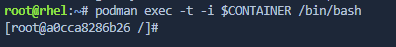

In 'Pane 1' of the lab interface, use a `podman exec` command to create an interactive shell inside the running container.

```bash
podman exec -t -i $CONTAINER /bin/bash
```



Check the container's access to the */home* directory

```bash
cd /home; ls
```

<pre class="file">
ls: cannot open directory '.': Permission denied
</pre>

In 'Pane 0' of the lab interface, query the SELinux policy to search for allow enforcement rules applied to access */home* directory

```bash
sesearch -A -s container_t -t home_root_t -c dir -p read
```

The search returns NO results. Since, there is no allow rule for container_t type to get read access to the */home* directory, access
is blocked by SELinux.

In 'Pane 1' tab of the lab interface, check the container's access to the */var/spool/* directory

```bash
cd /var/spool/; ls
```

<pre class="file">
ls: cannot open directory '.': Permission denied
</pre>

SELinux is restricting access to the */var/spool* directory.

In 'Pane 1' tab of the lab interface, check the container's write access to the */var/spool/* directory

```bash
touch test
```

<pre class="file">
touch: cannot touch 'test': Permission denied
</pre>

In 'Pane 0' of the lab interface, query the SELinux policy to search for allow enforcement rules applied to access */var/spool* directory

```bash
sesearch -A -s container_t -t var_spool_t -c dir -p read
```

The search returns NO results. Since, there is no allow rule for container_t type to get read access to the */var/spool/* directory, access
is blocked by SELinux.

Query the SELinux policy for network access for container_t types

```bash
sesearch -A -s container_t -t port_type -c tcp_socket
```

<pre class="file">
allow container_net_domain port_type:tcp_socket { name_bind name_connect recv_msg send_msg };
allow corenet_unconfined_type port_type:tcp_socket { name_bind name_connect recv_msg send_msg };
allow sandbox_net_domain port_type:tcp_socket { name_bind name_connect recv_msg send_msg };
</pre>

Sandbox is the default process type (domain) in SELinux, and container is the domain used in the context of containers. The corenet type
is typically used in the context of the Linux kernel. The output means that for each of these domains, binding, connecting, sending and receiving
messages are allowed without TCP port restrictions.
