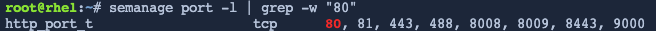

You can verify the policies generated using Udica for the container and enforced by SELinux.

Query the SELinux policy on the container host to search for allow enforcement rules applied to access */home* directory.

In `Terminal 1`, enter the following.

```bash
sesearch -A -s my_container.process -t home_root_t -c dir -p read
```

<pre class="file">
allow my_container.process home_root_t:dir { getattr ioctl lock open read search };
</pre>

There is an allow rule in place that allows read access to the */home* directory.

Query the SELinux policy on the container host to search for allow enforcement rules applied to access */var/spool/* directory.

```bash
sesearch -A -s my_container.process -t var_spool_t -c dir -p read
```

<pre class="file">
allow my_container.process var_spool_t:dir { add_name getattr ioctl lock open read remove_name searchwrite };
</pre>

There is an allow rule in place that allows read access to the *var/spool* directory.

Query the SELinux policy on the container host to check network access

```bash
sesearch -A -s my_container.process -t port_type -c tcp_socket
```

<pre class="file">
allow my_container.process http_port_t:tcp_socket { name_bind name_connect recv_msg send_msg };
</pre>

Retrieve the SELinux type associated with TCP port 80. TCP port 80 is the port that Apache will bind on.

```bash
semanage port -l | grep -w "80"
```

<a href="#example_image">
 
</a>

<a href="#" class="lightbox" id="example_image">
 
</a>

<style>
.lightbox {
  display: none;
  position: fixed;
  justify-content: center;
  align-items: center;
  z-index: 999;
  top: 0;
  left: 0;
  right: 0;
  bottom: 0;
  padding: 1rem;
  background: rgba(0, 0, 0, 0.8);
}

.lightbox:target {
  display: flex;
}

.lightbox img {
  max-height: 100%;
}
</style>
