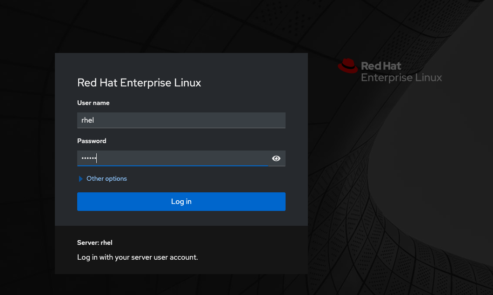
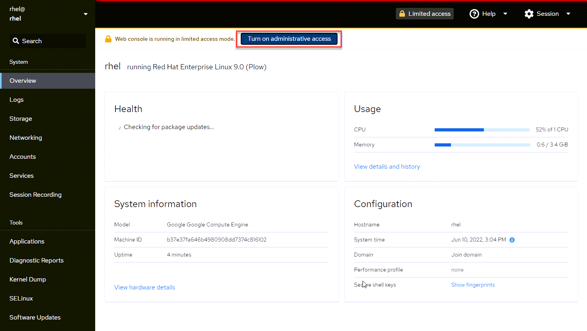
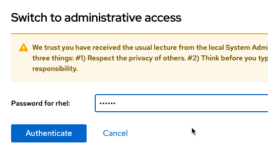
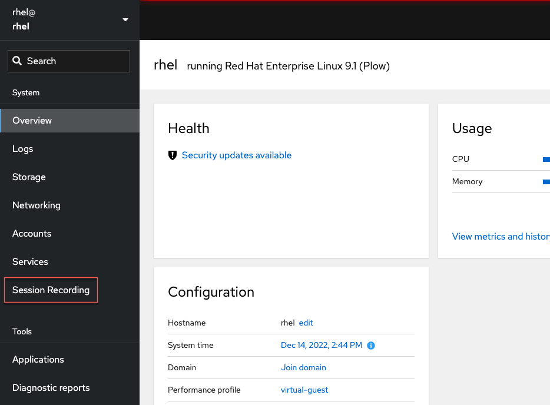

Now that the required software is installed, it is time to configure and enable terminal session recording.  You will use the Web Console to perform this task.

Use the *Web Console* tab in your lab environment to log into the Web Console for the system.  You should use the following credentials:

Username: __rhel__
Password: __redhat__

>**NOTE:** Problems accessing the Web Console or logging in? For best results, copy and paste the URL into Google Chrome.

Next, turn on administrative access. Click on the `Turn on administrative access` button.

Enter the Password `redhat`.

Now that you are logged into the Web console, and because you have installed the __cockpit-session-recording__ rpm package, you can now select the *Session Recording* option in the left-side navigation menu.

