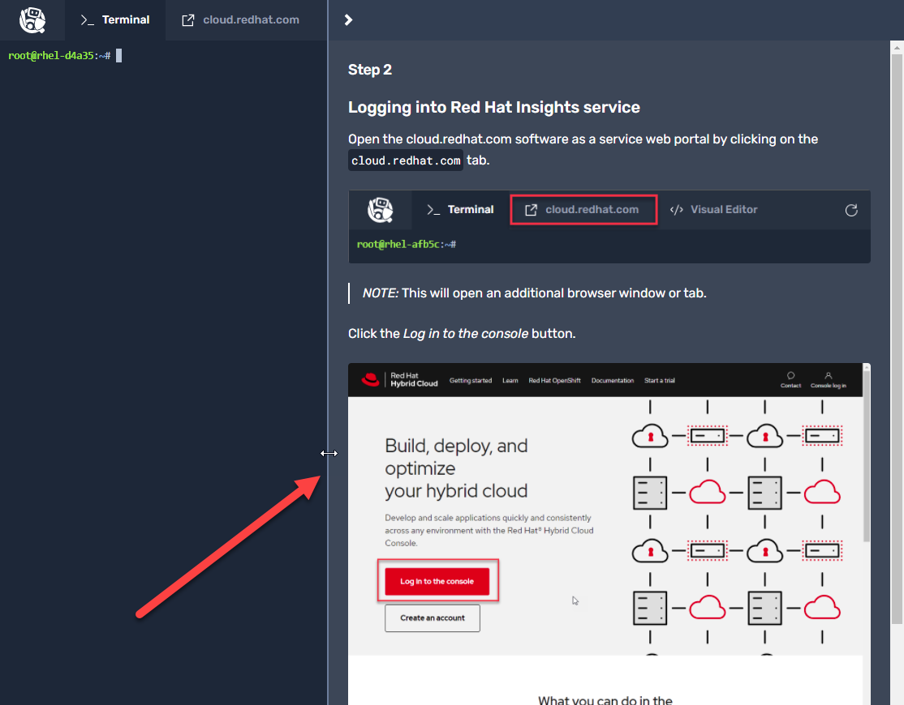
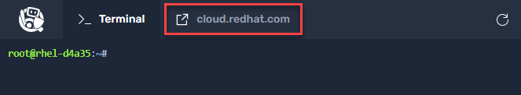
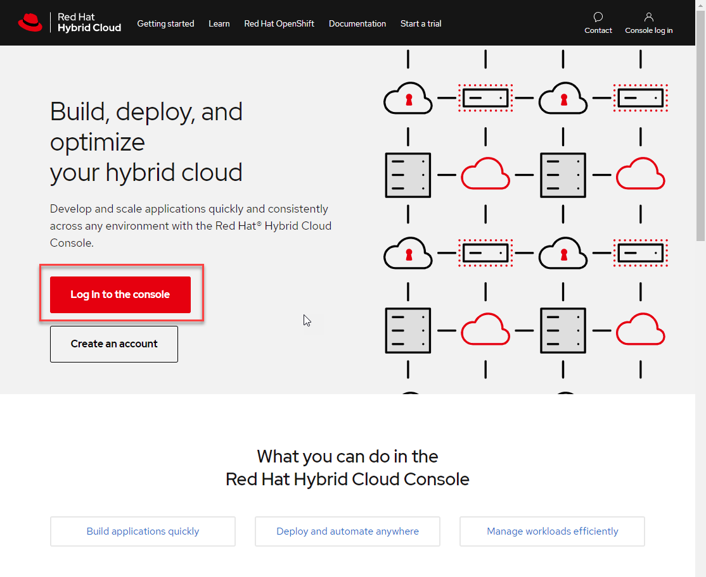
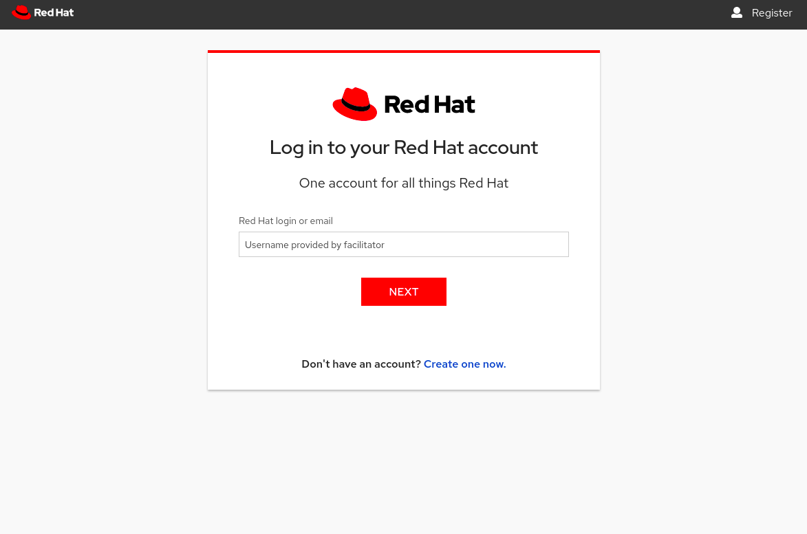
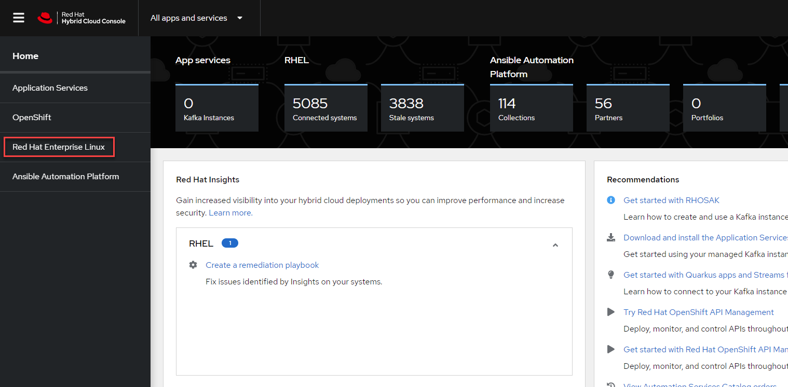

# Logging into Red Hat Insights service

>_NOTE:_ To make the inline images larger, expand this window.


Open the cloud.redhat.com software as a service web portal by clicking on the `cloud.redhat.com` tab.



>_NOTE:_ This will open an additional browser window or tab.

Click the _Log in to the console_ button.



Login using the credentials below:

Login: __rhel-df93__

```bash
rhel-df93
```

Password: __Redhat1!__

```bash
Redhat1!
```



Once you are logged in, click on _Red Hat Enterprise Linux_.


