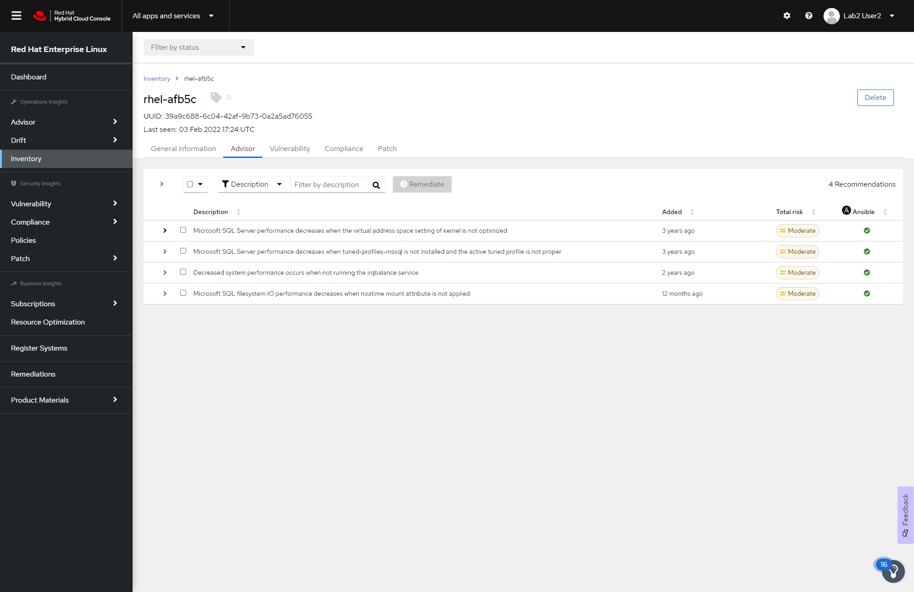

# Remediating the reported Insight

The reported Insight for mssql-server service had a suggested resolution of
changing ownership or group of the Microsoft SQL Server directory __/var/opt/mssql__ from root to
mssql.

First, verify the user and group for __/var/opt/mssql__:

```
stat -c "%U %G" /var/opt/mssql
```

<pre class=file>
root root
</pre>

Next, you will change the user and group ownership of __/var/opt/mssql__ from root to mssql.

```
chown -R mssql:mssql /var/opt/mssql
```

Verify that the user and group ownership is now updated:

```
stat -c "%U %G" /var/opt/mssql
```

<pre class=file>
mssql mssql
</pre>

Now that the ownership of the mssql-server directory is updated, restart the
SQL Server service.

```
systemctl restart mssql-server.service
```

Force a Red Hat Insights check-in so that a new batch of system data
is uploaded to the Insights service.

```
insights-client
```

<pre class=file>
Starting to collect Insights data for a06560c57e40
Uploading Insights data.
Successfully uploaded report from a06560c57e40 to account 6227255.
</pre>

Refresh the `Advisor` page and notice that the ownership problem is removed.

