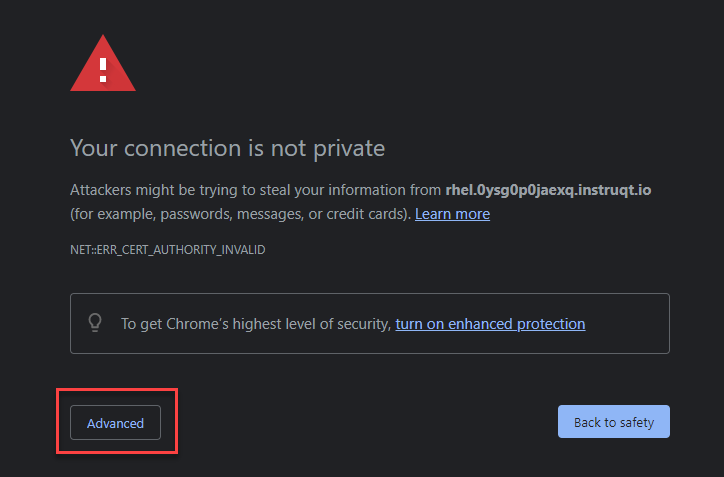
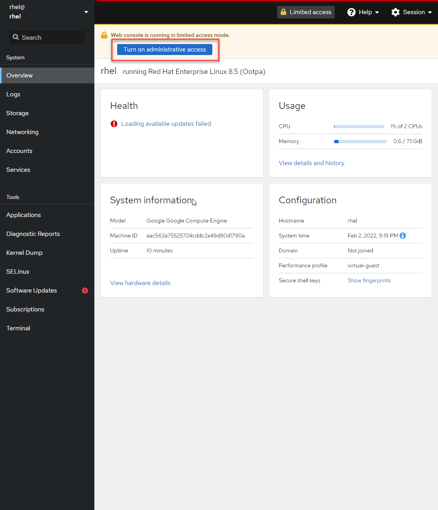
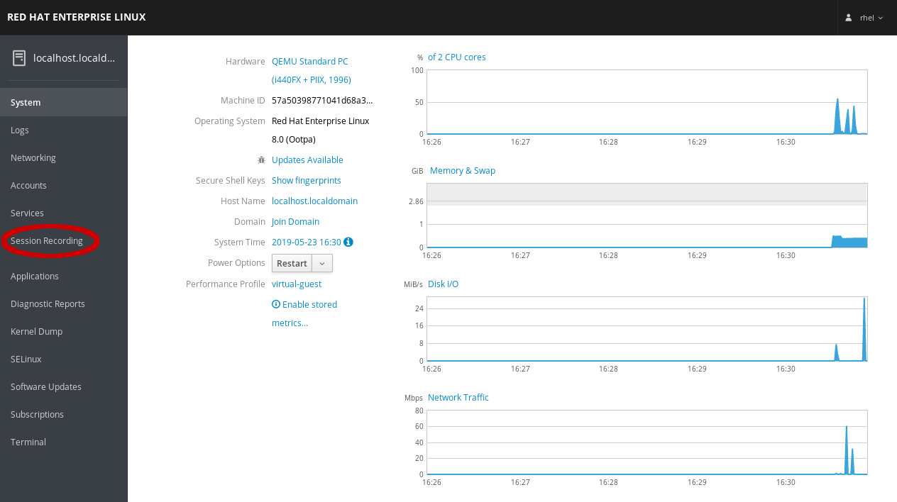

## Start the Web Console service

Start the Web Console service by entering the following:

```bash
systemctl start cockpit
```

Check that the Web Console service is running:

```bash
systemctl status cockpit --no-pager
```

<pre class="file">
● cockpit.service - Cockpit Web Service
   Loaded: loaded (/usr/lib/systemd/system/cockpit.service; static; vendor preset: disab>
   Active: active (running) since Fri 2022-02-04 03:32:21 UTC; 1s ago
     Docs: man:cockpit-ws(8)
  Process: 121574 ExecStartPre=/usr/libexec/cockpit-certificate-ensure (code=exited, sta>
 Main PID: 121578 (cockpit-tls)
    Tasks: 1 (limit: 46230)
   Memory: 692.0K
   CGroup: /system.slice/cockpit.service
           └─121578 /usr/libexec/cockpit-tls

Feb 04 03:32:21 rhel systemd[1]: Starting Cockpit Web Service...
Feb 04 03:32:21 rhel systemd[1]: Started Cockpit Web Service.
</pre>

## Logging in and navigating Web Console

Click on the tab titled **RHEL Web Console** at the top of  your lab system interface. Selecting this tab will open the lab system's Web Console in a
new browser tab or window.


Click `Advanced`



Then click `Proceed to rhel.xxxx.instruqt.io`


Once the login page is presented, use the following credentials to log into the Web Console:

Username: **rhel**\
Password: **redhat**


## Turn on administrative access

Click `Turn on administrative access`.



Next do the following:

1) Enter the password: **redhat**
2) Click `Authenticate`


## Session Recording

Now that you are logged into the Web console, and because you have installed the __cockpit-session-recording__ rpm package, you can now select the *Session Recording* option in the left-side navigation menu.


