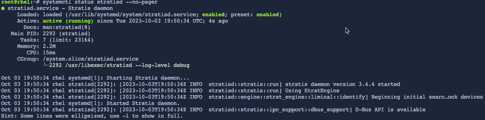

In this challenge, we'll install Stratis.

Stratis consists of two components.

First, the Stratis daemon, stratisd:
- manages collections of block devices
- provides a D-Bus API

Second, the Stratis command-line interface, stratis-cli:
- uses the D-Bus API to communicate with stratisd

To start off, install the stratisd and stratis-cli packages using a software package manager.

```bash,run
dnf -y install stratisd stratis-cli
```

You can check the stratis-cli version.

```bash,run
stratis --version
```

Now, enable and start the stratisd systemd service using the systemctl utility.

```bash,run
systemctl --now enable stratisd
```

At any point, you may also check the status of stratisd.

```bash,run
systemctl status stratisd --no-pager
```


If stratisd is running, you should see the Active: information report active (running) as it is shown in the above output from the systemctl status command.
