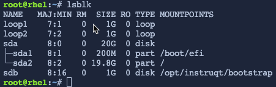
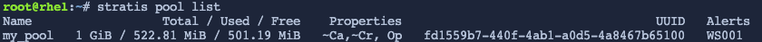
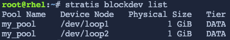

List the pseudo block devices
=============================

This lab simulates block devices so we won't be using actual drives. This limitation has no material effect on how Stratis would manage real block devices on a server or VM.

Use the command `lsblk`. The output will be similar to below.

```bash,run
lsblk
```



The pseudo block devices `loop1` and `loop2` are available. We will use them to demonstrate the capabilities of Stratis.

Create a storage pool
=====================

Now we'll create a storage pool. This pool is created from one or more local disks or partitions, and file systems are created from the pool.

A pool has a fixed total size, equal to the size of the block devices.

The pool contains most Stratis layers, such as the non-volatile data cache using the dm-cache target.

Stratis creates a /dev/stratis/my-pool/ directory for each pool. This directory contains links to devices that represent Stratis file systems in the pool.

Create the pool `my_pool` from the block device `/dev/loop1` with the command below.

```bash,run
stratis pool create my_pool /dev/loop1
```

List the pool you just created.

```bash,run
stratis pool list
```

The output should look similar to the following below.



Add another block device to the existing pool.
==============================================

All pools contain a data tier, which contains one or more block devices used to store data. The block devices used to create the pool belong to the pool's data tier.

You can add additional block devices to a pool as data devices, thereby increasing the disk space provided to the Stratis pool. This is helpful when you have exhaused the available space initially allocated to the pool.

The pool you created, `my_pool``, has 1 GiB of space. Add /dev/loop2 as a data device to my_pool.

```bash,run
stratis pool add-data my_pool /dev/loop2
```

List the block devices.
=======================

```bash,run
stratis blockdev list
```



You can see that both /dev/loop1 and /dev/loop2 belong to my_pool.
