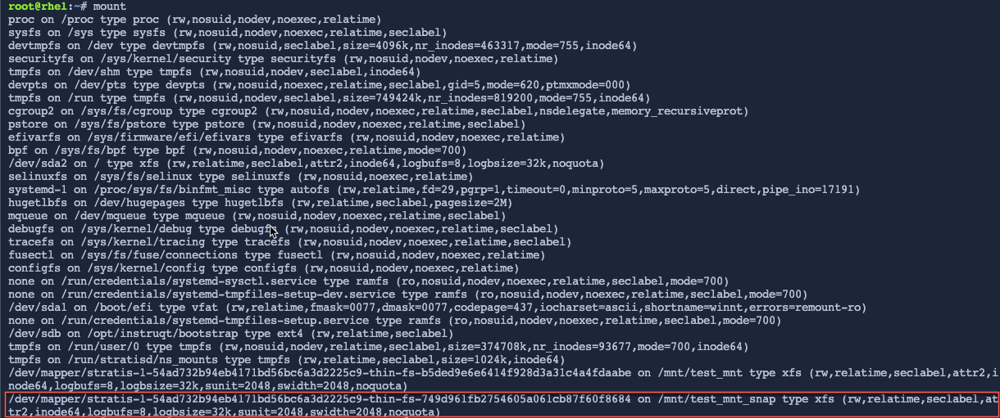

Create a snapshot
=================

A snapshot of a filesystem is a read/writeable thinly provisioned point in time copy of the source filesystem. To create a snapshot, you will need the name of the pool in which the filesystem is located, the name of the filesystem, and the name of the snapshot of the filesystem.

Create a snapshot of the filesystem. Name the snapshot `my_snapshot`.

```bash,run
stratis filesystem snapshot my_pool my_fs my_snapshot
```

Check that the snapshot was created successfully by listing the stratis filesystems.

```bash,run
stratis fs
```


You should see my_snapshot listed in the output.

Access the snapshot to recover files
====================================

Here is an example of how a snapshot can be used to recover deleted files from a filesystem.

Delete the first file that you created in the previous step.

```bash,run
rm -f /mnt/test_mnt/my_first_file
```

Check that `my_first_file`` has been deleted.

```bash,run
ls /mnt/test_mnt
```


You can see that `my_first_file` has been removed from the directory, and only `my_second_file` remains.

You can now mount the snapshot and get access to both files, since the snapshot was created before the file was deleted. First, create a new mountpoint to attach the snapshot into the filesystem, `/mnt/test_mnt_snap`.

```bash,run
mkdir /mnt/test_mnt_snap
```

Next, mount the snapshot, `my_snapshot`.

```bash,run
mount /dev/stratis/my_pool/my_snapshot /mnt/test_mnt_snap
```

Confirm that the snapshot was mounted successfully.

```bash,run
mount
```


From the output above, the snapshot is mounted on `/mnt/test_mnt_snap`.

List the files stored within the snapshot on `/mnt/test_mnt_snap`.

```bash,run
ls /mnt/test_mnt_snap
```


Both files are listed!

 Copy the file back to the original filesystem
 =============================================

 Now that you have access to the previously deleted file, `my_first_file`, you may want to copy it back into the original filesystem, `my_fs`.

To do this, copy the file, `my_first_file` back into the original filesytem.

```bash,run
cp /mnt/test_mnt_snap/my_first_file /mnt/test_mnt
```

Lastly, confirm that `my_first_file` has been copied to `/mnt/test_mnt`.

```bash,run
ls /mnt/test_mnt
```


The filesystem, `my_fs`, now contains the previously deleted file, `my_first_file`.
