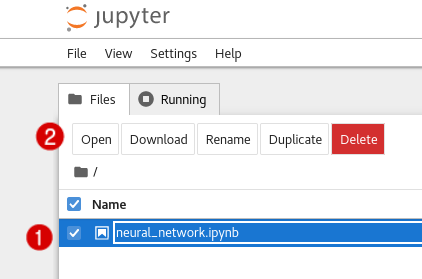
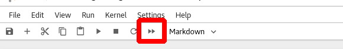
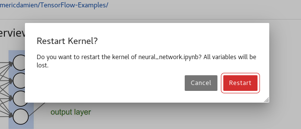

Click on the `Jupyter Notebook` tab near the top of the lab window. This will open your Jupyter Notebook in a new tab.

When presented with a login screen, enter `redhat` into the password box and click `Log in`.

When you reach the notebook's main menu, click on the check box to the left of `neural_network.ipynb`, and then click open.

First, take a look at the Jupyter Notebook. You'll notice that is structured as code surrounded by formatted text, offering context as to what the code is doing. In its current state, there is no visible output from your code. To view the output of your code, you will need to run the program.

To run all of the code, click on the button pictured below:

Next, you will be prompted with a dialog box asking whether you wish to restart the kernel. Click `Restart`.

The kernel will restart and your program will run. This may take a few seconds to finish.

