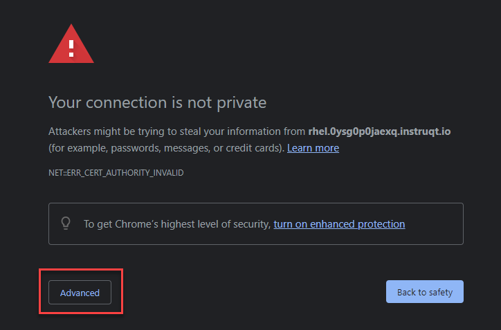

## Log in to the Web Console

Click on the tab titled **RHEL Web Console** at the top of  your lab system interface. Selecting this tab will open the lab system's Web Console in a
new browser tab or window.

Click `Advanced`

Then click `Proceed to rhel.xxxx.instruqt.io`

Once the login page is presented, use the following credentials to log into the Web Console:

Username: **rhel**\
Password: **redhat**

