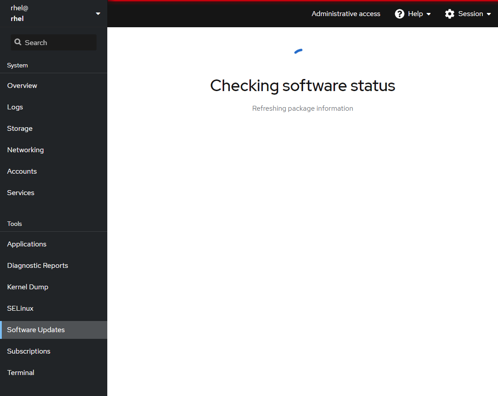

## Navigate to Software Updates application

Now that you are logged into the Web Console, we must turn on administrative access.

Click `Turn on administrative access`.

Next do the following:

1) Enter the password: **redhat**
2) Click `Authenticate`

Navigate to the **Software Updates** application.

It will take a little while to check software status.

