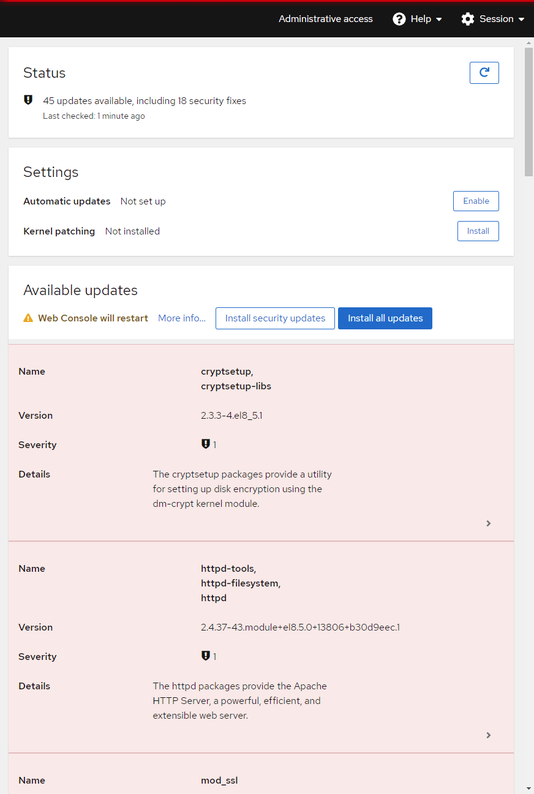

## Examine available updates

You can see on the **Software Updates** application that there are several updates available for your system.

In addition to the software package names and versions, the update type is indicated in the **Severity** field.  In the **Details** section, you see the first entry in the software's changelog.

You'll be able to inspect additional information such as complete changelog entries from the package developer, Common Vulnerability and Exposures (CVE) number [if applicable], and more.

Once you have explored the information provided with the updates, please move to the next step.
