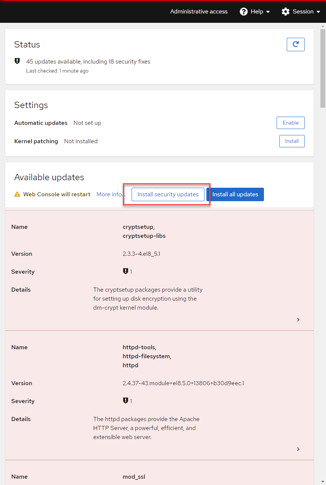

Notice that there are a mix of updates available for the system.  Some of these are identified as __Security Updates__ by the shield icon in the __Severity__ field.

Also, you will notice that there is a button in the upper left corner entitled
__Install Security Updates__.

Use the __Install Security Updates__ button to apply this set of updates.

After the security updates are applied, you are prompted to restart the system so that the updates take effect.  We are not yet finished applying updates, so, for now, please __Ignore__ the restart request.

