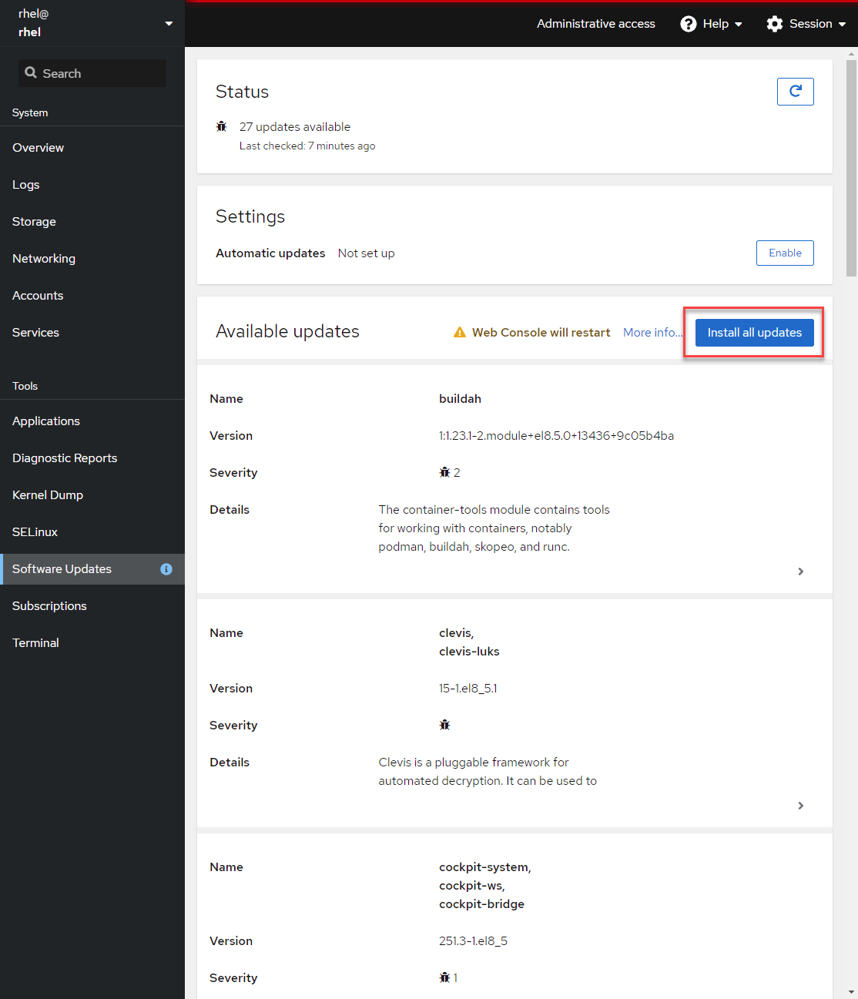

## Apply remaining available updates

In addition to targeting security updates, you may also apply all the updates on the system.

When you are ready, apply the available updates by clicking the __Install All Updates__ button.

Again you are asked to restart the system, this time, you can, if you choose to do so.

Now your system reports that it has been updated and requires a `Reboot` or `Restart services`.
